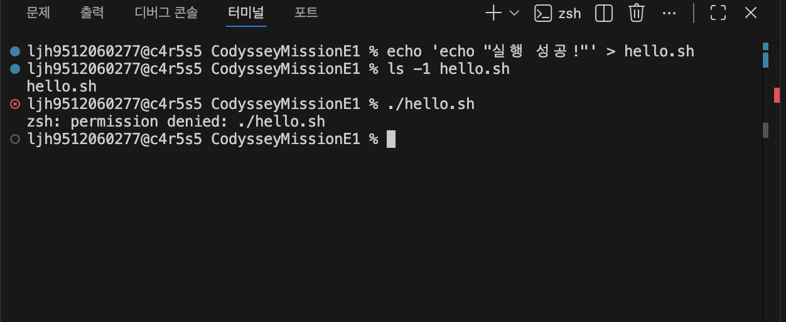
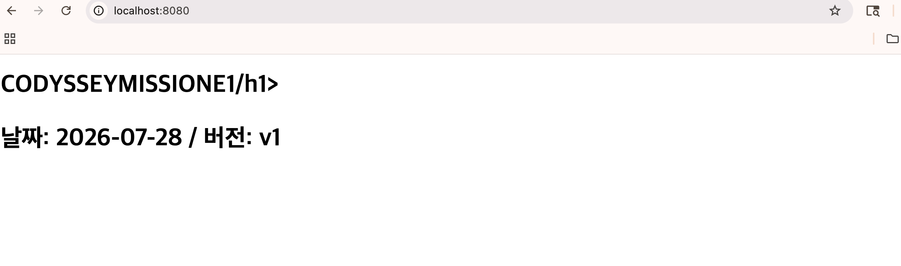
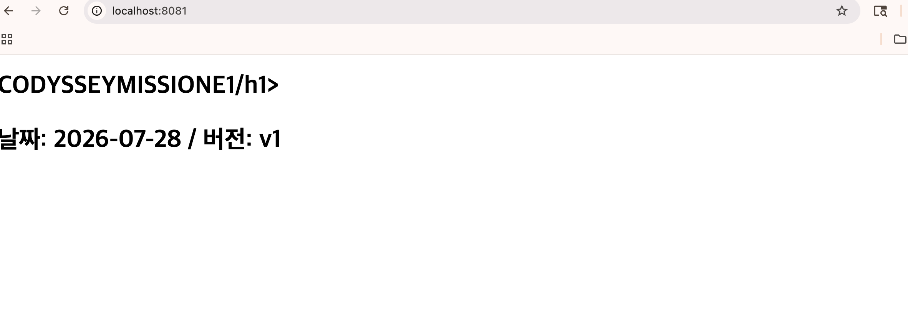
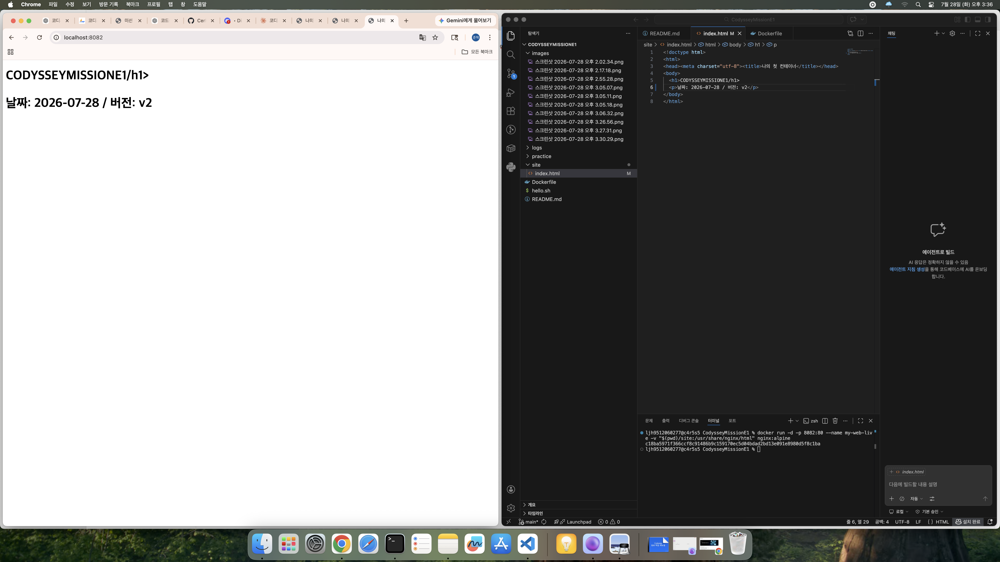
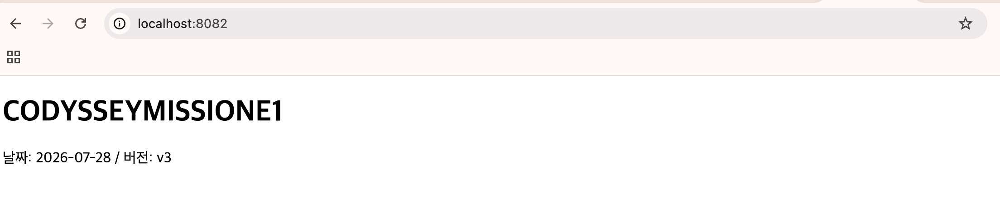
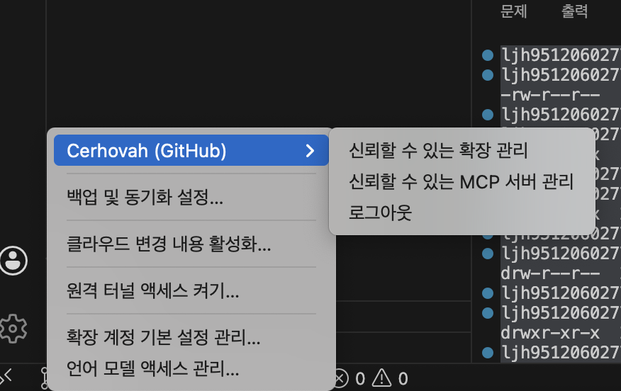
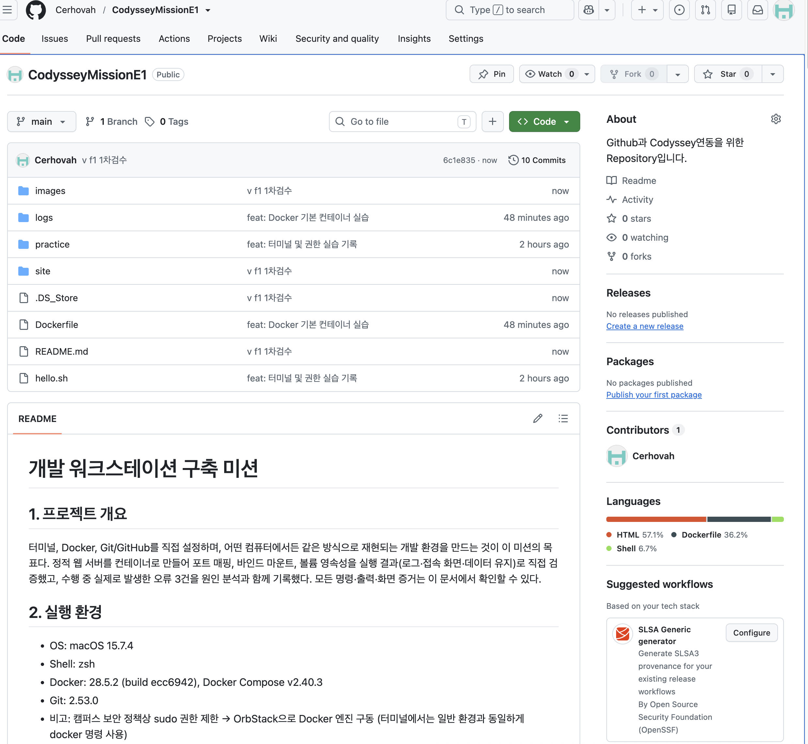

# 개발 워크스테이션 구축 미션

## 1. 프로젝트 개요

터미널, Docker, Git/GitHub를 직접 설정하며, 어떤 컴퓨터에서든 같은 방식으로 재현되는
개발 환경을 만드는 것이 이 미션의 목표다.
정적 웹 서버를 컨테이너로 만들어 포트 매핑, 바인드 마운트, 볼륨 영속성을
실행 결과(로그·접속 화면·데이터 유지)로 직접 검증했고,
수행 중 실제로 발생한 오류 3건을 원인 분석과 함께 기록했다.
모든 명령·출력·화면 증거는 이 문서에서 확인할 수 있다.

## 2. 실행 환경

- OS: macOS 15.7.4
- Shell: zsh
- Docker: 28.5.2 (build ecc6942), Docker Compose v2.40.3
- Git: 2.53.0
- 비고: 캠퍼스 보안 정책상 sudo 권한 제한 → OrbStack으로 Docker 엔진 구동
  (터미널에서는 일반 환경과 동일하게 docker 명령 사용)

## 3. 수행 체크리스트

- [x] 터미널 기본 조작(위치/목록/이동/생성/복사/이름변경/삭제/내용확인/빈파일)
- [x] 권한 변경 실습(파일 1개 + 디렉토리 1개, 전/후 비교)
- [x] Docker 설치·데몬 점검(version / info)
- [x] Docker 운영 명령(images / ps / ps -a / logs / stats)
- [x] hello-world 및 ubuntu 컨테이너 실습(종료/유지 차이 정리)
- [x] Dockerfile 직접 작성 → 커스텀 이미지 빌드/실행
- [x] 포트 매핑 접속 증거(2개 포트, 주소창 포함)
- [x] 바인드 마운트 변경 전/후 비교
- [x] 볼륨 영속성(컨테이너 삭제 전/후) 검증
- [x] Git 설정(git config --list) + GitHub·VSCode 연동

## 4. 수행 로그

> 로그는 실제 터미널 기록에서 발췌한 것이다. 단순 오타 재입력 줄은 제외했고,
> 실습에 의미가 있는 오류(권한 거부, 포트 충돌 등)는 그대로 남겼다.

### 4-1. 터미널 기본 조작

```
ljh9512060277@c4r5s5 CodysseyMissionE1 % pwd
/Users/ljh9512060277/CodysseyMissionE1
ljh9512060277@c4r5s5 CodysseyMissionE1 % ls -la
total 8
drwxr-xr-x   4 ljh9512060277  ljh9512060277   128  7 28 13:34 .
drwxr-x---+ 25 ljh9512060277  ljh9512060277   800  7 28 13:40 ..
drwxr-xr-x  15 ljh9512060277  ljh9512060277   480  7 28 13:40 .git
-rw-r--r--   1 ljh9512060277  ljh9512060277  3162  7 28 13:39 README.md
ljh9512060277@c4r5s5 CodysseyMissionE1 % mkdir images
ljh9512060277@c4r5s5 CodysseyMissionE1 % mkdir practice
ljh9512060277@c4r5s5 CodysseyMissionE1 % cd practice
ljh9512060277@c4r5s5 practice % touch memo.txt
ljh9512060277@c4r5s5 practice % cat memo.txt
ljh9512060277@c4r5s5 practice % cp memo.txt memo_copy.txt
ljh9512060277@c4r5s5 practice % mv memo_copy.txt note.txt
ljh9512060277@c4r5s5 practice % ls -la
total 0
drwxr-xr-x  4 ljh9512060277  ljh9512060277  128  7 28 13:45 .
drwxr-xr-x  6 ljh9512060277  ljh9512060277  192  7 28 13:45 ..
-rw-r--r--  1 ljh9512060277  ljh9512060277    0  7 28 13:45 memo.txt
-rw-r--r--  1 ljh9512060277  ljh9512060277    0  7 28 13:45 note.txt
ljh9512060277@c4r5s5 practice % rm note.txt
ljh9512060277@c4r5s5 practice % cd ..
ljh9512060277@c4r5s5 CodysseyMissionE1 % cd /tmp && pwd
/tmp
ljh9512060277@c4r5s5 /tmp % cd -
~/CodysseyMissionE1
ljh9512060277@c4r5s5 CodysseyMissionE1 % cd ./practice && pwd
/Users/ljh9512060277/CodysseyMissionE1/practice
```

절대 경로는 `/`부터 시작하는 전체 주소이고, 상대 경로는 현재 위치 기준의 길 안내다.
`/tmp`는 어디서 입력해도 같은 곳으로 이동하지만, `./practice`는 서 있는 위치에 따라
결과가 달라진다. 위 로그의 `cd /tmp`(절대)와 `cd ./practice`(상대)가 그 예시다.

### 4-2. 권한 실습 (전/후 비교)

실행 권한이 없는 스크립트를 실행하면 거부되는 것을 먼저 확인하고,
권한 부여 후 성공하는 과정을 기록했다.

```
ljh9512060277@c4r5s5 CodysseyMissionE1 % echo 'echo "실행 성공!"' > hello.sh
ljh9512060277@c4r5s5 CodysseyMissionE1 % ./hello.sh
zsh: permission denied: ./hello.sh
ljh9512060277@c4r5s5 CodysseyMissionE1 % chmod 755 hello.sh
ljh9512060277@c4r5s5 CodysseyMissionE1 % ./hello.sh
실행 성공!
ljh9512060277@c4r5s5 CodysseyMissionE1 % mkdir secret
ljh9512060277@c4r5s5 CodysseyMissionE1 % chmod 644 secret
ljh9512060277@c4r5s5 CodysseyMissionE1 % cd secret
cd: permission denied: secret
ljh9512060277@c4r5s5 CodysseyMissionE1 % chmod 755 secret
ljh9512060277@c4r5s5 CodysseyMissionE1 % cd secret && cd ..
ljh9512060277@c4r5s5 CodysseyMissionE1 % rm -r secret
```



권한 표기의 변경 전/후는 `ls -l`로 다음과 같이 확인했다.

```
ljh9512060277@c4r5s5 CodysseyMissionE1 % chmod 644 hello.sh
ljh9512060277@c4r5s5 CodysseyMissionE1 % ls -l hello.sh
-rw-r--r--  1 ljh9512060277  ljh9512060277  22  7 28 14:01 hello.sh
ljh9512060277@c4r5s5 CodysseyMissionE1 % chmod 755 hello.sh
ljh9512060277@c4r5s5 CodysseyMissionE1 % ls -l hello.sh
-rwxr-xr-x  1 ljh9512060277  ljh9512060277  22  7 28 14:01 hello.sh
ljh9512060277@c4r5s5 CodysseyMissionE1 % mkdir secret
ljh9512060277@c4r5s5 CodysseyMissionE1 % ls -ld secret 
drwxr-xr-x  2 ljh9512060277  ljh9512060277  64  7 28 16:13 secret
ljh9512060277@c4r5s5 CodysseyMissionE1 % chmod 644 secret
ljh9512060277@c4r5s5 CodysseyMissionE1 % ls -ld secret
drw-r--r--  2 ljh9512060277  ljh9512060277  64  7 28 16:13 secret
ljh9512060277@c4r5s5 CodysseyMissionE1 % chmod 755 secret
ljh9512060277@c4r5s5 CodysseyMissionE1 % ls -ld secret
drwxr-xr-x  2 ljh9512060277  ljh9512060277  64  7 28 16:13 secret
ljh9512060277@c4r5s5 CodysseyMissionE1 % rm -r secret
```

권한은 소유자·그룹·그 외 세 부류에 대해 읽기 r=4, 쓰기 w=2, 실행 x=1을 더한
숫자로 표기한다. 755는 "소유자는 전부(rwx), 나머지는 읽기와 실행만(r-x)",
644는 "소유자는 읽고 쓰기(rw-), 나머지는 읽기만(r--)"이라는 뜻이다.
디렉토리에서 실행(x) 권한은 "그 안으로 들어갈 수 있음"을 의미하며,
위 로그에서 644로 낮춘 폴더에 cd가 거부된 것이 그 증거다.

### 4-3. Docker 설치·점검

```
ljh9512060277@c4r5s5 CodysseyMissionE1 % docker --version
Docker version 28.5.2, build ecc6942
ljh9512060277@c4r5s5 CodysseyMissionE1 % docker info
Client:
 Version:    28.5.2
 Context:    orbstack
 Debug Mode: false
(…중략…)
Server:
 Server Version: 28.5.2
 Storage Driver: overlay2
 Kernel Version: 6.17.8-orbstack-00308-g8f9c941121b1
 Operating System: OrbStack
 OSType: linux
 Architecture: x86_64
 CPUs: 6
 Total Memory: 15.67GiB
(…이하 네트워크 풀 등 상세 출력 중략…)
```

`docker info`가 Server 정보를 정상 출력하는 것으로 Docker 데몬 동작을 확인했다.
Context가 orbstack으로 표시되어, sudo 없이 OrbStack이 엔진을 구동 중임을 알 수 있다.

### 4-4. 컨테이너 실습 (hello-world / ubuntu / 종료·유지 관찰)

```
ljh9512060277@c4r5s5 CodysseyMissionE1 % docker run hello-world

Hello from Docker!
This message shows that your installation appears to be working correctly.

To generate this message, Docker took the following steps:
 1. The Docker client contacted the Docker daemon.
 2. The Docker daemon pulled the "hello-world" image from the Docker Hub.
    (amd64)
 3. The Docker daemon created a new container from that image which runs the
    executable that produces the output you are currently reading.
 4. The Docker daemon streamed that output to the Docker client, which sent it
    to your terminal.
(…이하 안내문 중략…)

ljh9512060277@c4r5s5 CodysseyMissionE1 % docker images
REPOSITORY    TAG       IMAGE ID       CREATED        SIZE
ubuntu        latest    de7345b16e94   2 weeks ago    100MB
hello-world   latest    e2ac70e7319a   4 months ago   10.1kB
ljh9512060277@c4r5s5 CodysseyMissionE1 % docker ps
CONTAINER ID   IMAGE     COMMAND   CREATED   STATUS    PORTS     NAMES
ljh9512060277@c4r5s5 CodysseyMissionE1 % docker ps -a
CONTAINER ID   IMAGE         COMMAND    CREATED          STATUS                      PORTS     NAMES
f36c1ebb72ee   hello-world   "/hello"   11 seconds ago   Exited (0) 11 seconds ago             brave_diffie
8a3fc59746c3   hello-world   "/hello"   5 minutes ago    Exited (0) 5 minutes ago              wonderful_shockley
```

hello-world 한 번의 실행으로 "이미지 내려받기 → 컨테이너 생성 → 실행 → 출력"이라는
기본 회로 전체가 정상임이 확인된다. `docker images`에는 설계도(이미지)가,
`docker ps -a`에는 그 설계도로 만들어져 실행을 마친 실행체(컨테이너)가 따로 보인다.

```
ljh9512060277@c4r5s5 CodysseyMissionE1 % docker run -it --name ub1 ubuntu bash
root@bf4efb8e9425:/# ls /
bin   dev  home  lib64  mnt  proc  run   srv  tmp  var
boot  etc  lib   media  opt  root  sbin  sys  usr
root@bf4efb8e9425:/# echo "running inside container"
running inside container
root@bf4efb8e9425:/# exit
exit
ljh9512060277@c4r5s5 CodysseyMissionE1 % docker ps -a
CONTAINER ID   IMAGE         COMMAND    CREATED              STATUS                     PORTS     NAMES
bf4efb8e9425   ubuntu        "bash"     About a minute ago   Exited (0) 8 seconds ago             ub1
f36c1ebb72ee   hello-world   "/hello"   2 minutes ago        Exited (0) 2 minutes ago             brave_diffie
8a3fc59746c3   hello-world   "/hello"   8 minutes ago        Exited (0) 8 minutes ago             wonderful_shockley
ljh9512060277@c4r5s5 CodysseyMissionE1 % docker run -d --name ub2 ubuntu sleep infinity
d8ccc4e382e2d6d4b3da19a499f2d5ba7c3bbabce491c499ddf471c846d5bba8
ljh9512060277@c4r5s5 CodysseyMissionE1 % docker exec -it ub2 bash
root@d8ccc4e382e2:/# exit
exit
ljh9512060277@c4r5s5 CodysseyMissionE1 % docker ps
CONTAINER ID   IMAGE     COMMAND            CREATED          STATUS          PORTS     NAMES
d8ccc4e382e2   ubuntu    "sleep infinity"   18 seconds ago   Up 17 seconds             ub2
ljh9512060277@c4r5s5 CodysseyMissionE1 % docker stats --no-stream
CONTAINER ID   NAME      CPU %     MEM USAGE / LIMIT    MEM %     NET I/O         BLOCK I/O     PIDS
d8ccc4e382e2   ub2       0.00%     1.93MiB / 15.67GiB   0.01%     1.13kB / 126B   14.7MB / 0B   1
```

대화형 실행(run -it)은 내가 곧 컨테이너의 본체 작업이라 exit하면 함께 종료되지만
(ub1이 Exited로 남음), 배경 실행 후 exec로 들어가면 옆문으로 드나드는 것이라
나가도 컨테이너가 유지된다(ub2가 Up 유지). attach는 본체 작업에 직접 붙는 방식이라
빠져나오는 방법(Ctrl+P, Ctrl+Q)에 따라 컨테이너가 함께 꺼질 수 있다.

### 4-5. 커스텀 이미지 (Dockerfile)

기존 베이스로 경량 웹 서버 이미지인 `nginx:alpine`을 선택했다.
포트 매핑·마운트 검증과 자연스럽게 이어지는 웹 서버라는 점, 용량이 작아
빌드가 빠르다는 점이 선택 이유다. 직접 작성한 Dockerfile은 다음과 같다.

```dockerfile
FROM nginx:alpine
LABEL org.opencontainers.image.title="mission1-web"
ENV APP_ENV=dev
COPY site/ /usr/share/nginx/html/
```

커스텀 포인트와 각각의 목적:
1. LABEL — 이미지에 이름표를 붙여 무엇을 위한 이미지인지 식별 가능하게 함
2. ENV — 환경 변수를 심어 설정과 코드를 분리하는 구조를 연습
3. COPY — nginx 기본 페이지를 직접 만든 정적 페이지(site/)로 교체

빌드 로그:

```
ljh9512060277@c4r5s5 CodysseyMissionE1 % docker build -t my-web:1.0 .
[+] Building 1.4s (7/7) FINISHED                                   docker:orbstack
 => [internal] load build definition from Dockerfile                          0.1s
 => [internal] load metadata for docker.io/library/nginx:alpine               0.8s
 => [internal] load .dockerignore                                             0.1s
 => [internal] load build context                                             0.1s
 => [1/2] FROM docker.io/library/nginx:alpine@sha256:4a73073bd557c65b759505d  0.0s
 => CACHED [2/2] COPY site/ /usr/share/nginx/html/                            0.0s
 => exporting to image                                                        0.1s
 => => naming to docker.io/library/my-web:1.0                                 0.0s
```

### 4-6. 포트 매핑 접속 증거

같은 이미지로 컨테이너 두 개를 서로 다른 포트(8080, 8081)에 실행하고,
curl과 브라우저 양쪽에서 접속을 확인했다.

```
ljh9512060277@c4r5s5 CodysseyMissionE1 % docker run -d -p 8080:80 --name my-web-8080 my-web:1.0
9992a5bb108dd8fd73aa7997779d9b8242e2e4f8abf1a197773c5fe3f0ba66b8
ljh9512060277@c4r5s5 CodysseyMissionE1 % curl http://localhost:8080
<!doctype html>
<html>
<head><meta charset="utf-8"><title>나의 첫 컨테이너</title></head>
<body>
  <h1>CODYSSEYMISSIONE1/h1>
  <p>날짜: 2026-07-28 / 버전: v1</p>
</body>
</html>
ljh9512060277@c4r5s5 CodysseyMissionE1 % docker run -d -p 8081:80 --name my-web-8081 my-web:1.0
f47b01e69bf0151decb213b7d43e9ab079b3b3def38582b3d7537ad9c9f9cbce
ljh9512060277@c4r5s5 CodysseyMissionE1 % curl http://localhost:8081
<!doctype html>
<html>
<head><meta charset="utf-8"><title>나의 첫 컨테이너</title></head>
<body>
  <h1>CODYSSEYMISSIONE1/h1>
  <p>날짜: 2026-07-28 / 버전: v1</p>
</body>
</html>
```

> 위 응답의 `/h1>` 표기는 당시 index.html의 닫는 태그 오타로,
> 상세 내용과 해결 과정은 트러블슈팅 사례 3에 기록했다.

브라우저 접속 화면(주소창 포함):





접속 흔적은 컨테이너 로그와 자원 사용량으로도 확인했다.

```
ljh9512060277@c4r5s5 CodysseyMissionE1 % docker logs my-web-8080
/docker-entrypoint.sh: Configuration complete; ready for start up
2026/07/28 06:26:20 [notice] 1#1: nginx/1.31.3
2026/07/28 06:26:20 [notice] 1#1: start worker processes
(…중략…)
192.168.215.1 - - [28/Jul/2026:06:26:32 +0000] "GET / HTTP/1.1" 200 188 "-" "curl/8.7.1" "-"
192.168.215.1 - - [28/Jul/2026:06:26:45 +0000] "GET / HTTP/1.1" 304 0 "-" "Mozilla/5.0 (Macintosh; Intel Mac OS X 10_15_7) AppleWebKit/537.36 (KHTML, like Gecko) Chrome/146.0.0.0 Safari/537.36" "-"
ljh9512060277@c4r5s5 CodysseyMissionE1 % docker stats --no-stream
CONTAINER ID   NAME          CPU %     MEM USAGE / LIMIT     MEM %     NET I/O           BLOCK I/O         PIDS
f47b01e69bf0   my-web-8081   0.00%     6.02MiB / 15.67GiB    0.04%     2.83kB / 1.61kB   344kB / 8.19kB    7
9992a5bb108d   my-web-8080   0.00%     5.324MiB / 15.67GiB   0.03%     3.29kB / 1.61kB   10.2MB / 8.19kB   7
```

컨테이너는 격리된 방이라 바깥에서 직접 접근할 수 없고, 내 컴퓨터의 포트와
컨테이너 안 포트를 연결(매핑)해야 접속이 된다. 로그의 접속 기록(curl, Chrome)이
매핑이 실제로 동작했다는 증거이며, 같은 이미지 하나로 8080과 8081에 두 개를
나란히 띄울 수 있는 것 자체가 격리와 포트 매핑의 증명이다.

### 4-7. 바인드 마운트 / 볼륨 영속성

**바인드 마운트** — 호스트의 site 폴더를 컨테이너의 웹 루트에 연결해,
파일 수정이 즉시 반영되는지 확인했다.

```
ljh9512060277@c4r5s5 CodysseyMissionE1 % docker run -d -p 8082:80 --name my-web-live -v "$(pwd)/site:/usr/share/nginx/html" nginx:alpine
c18ba5971f366ccf8c91486b9c159170ec5d04bdad2bd13e091e8980d5f8c1ba
```

변경 전(버전 v2 상태):



호스트에서 index.html을 수정(버전 v2 → v3, 닫는 태그 오타 수정)하고 저장한 뒤,
이미지를 다시 빌드하지 않고 새로고침만으로 반영을 확인했다.

변경 후(버전 v3, 오타 수정 반영):



**[보충 2: index.html 수정(v3, 닫는 태그 수정) 후 8082 새로고침 화면을
images/mount-after.png로 저장하면 위 이미지가 표시됨]**

**볼륨 영속성** — 볼륨을 만들어 컨테이너에 연결하고, 컨테이너를 완전히 삭제한 뒤
새 컨테이너에서 데이터가 살아 있는지 확인했다.

```
ljh9512060277@c4r5s5 CodysseyMissionE1 % docker volume create mission-data
mission-data
ljh9512060277@c4r5s5 CodysseyMissionE1 % docker run -d --name keeper -v mission-data:/data ubuntu sleep infinity
0edd0d93076b8b4fbf775750b0755b4c4277743d6ae0e1229f81ebb86089320f
ljh9512060277@c4r5s5 CodysseyMissionE1 % docker exec keeper bash -c "echo '컨테이너가 삭제되어도 남는 기록' > /data/proof.txt"
ljh9512060277@c4r5s5 CodysseyMissionE1 % docker exec keeper cat /data/proof.txt
컨테이너가 삭제되어도 남는 기록
ljh9512060277@c4r5s5 CodysseyMissionE1 % docker rm -f keeper
keeper
ljh9512060277@c4r5s5 CodysseyMissionE1 % docker run -d --name keeper2 -v mission-data:/data ubuntu sleep infinity
1b35dfd8cbf4e971371478ad02f40d9ede0a5cddc29041c8862887f62d57e3f2
ljh9512060277@c4r5s5 CodysseyMissionE1 % docker exec keeper2 cat /data/proof.txt
컨테이너가 삭제되어도 남는 기록
```

볼륨은 도커가 관리하는 별도 저장 공간이라 컨테이너보다 오래 산다.
keeper를 삭제(rm -f)했는데도 keeper2에서 같은 데이터가 읽히는 마지막 출력이 그 증거다.
바인드 마운트는 개발 편의(수정 즉시 반영)용, 볼륨은 데이터 보존용이라는 점이 둘의 차이다.

### 4-8. Git 설정 및 GitHub·VSCode 연동

```
ljh9512060277@c4r5s5 CodysseyMissionE1 % git config --global user.name "cerhovah"
ljh9512060277@c4r5s5 CodysseyMissionE1 % git config --global user.email "lj*****@gmail.com"
ljh9512060277@c4r5s5 CodysseyMissionE1 % git config --global init.defaultBranch main
ljh9512060277@c4r5s5 CodysseyMissionE1 % git config --list
credential.helper=osxkeychain
user.name=cerhovah
user.email=lj*****@gmail.com
init.defaultbranch=main
core.repositoryformatversion=0
core.filemode=true
core.bare=false
core.logallrefupdates=true
core.ignorecase=true
core.precomposeunicode=true
remote.origin.url=https://github.com/Cerhovah/CodysseyMissionE1.git
branch.main.remote=origin
branch.main.merge=refs/heads/main
```

> 개인정보 보호를 위해 이메일 주소는 일부 마스킹했다.

GitHub 저장소를 VSCode로 복제(clone)하여 작업했고, 커밋·푸시가 GitHub에
정상 반영되는 것으로 연동을 확인했다.

VSCode 계정 연동 화면:



푸시 후 GitHub 커밋 반영 화면:



**[보충 3: 위 두 캡처를 images/vscode-github.png, images/github-commits.png로
저장하면 이미지가 표시됨]**

Git은 내 컴퓨터에서 변경 이력을 기록·되돌리기 하는 도구이고, GitHub는 그 기록을
올려 공유·협업하는 원격 플랫폼이다. 이 저장소의 커밋 이력 자체가 단계별 수행 순서의
기록이기도 하다.

## 5. 검증 방법 요약

| 확인 대상 | 사용한 명령/방법 | 증거 위치 |
|---|---|---|
| 터미널 기본 조작 | pwd, ls -la, mkdir, cp, mv, rm, cat, touch | 4-1 로그 |
| 절대/상대 경로 | cd /tmp ↔ cd ./practice 비교 | 4-1 로그 |
| 권한 전/후 | ls -l / ls -ld, chmod 644·755 | 4-2 로그, images/permission-denied.png |
| Docker 데몬 동작 | docker --version, docker info | 4-3 로그 |
| 컨테이너 상태/자원 | docker ps, ps -a, stats | 4-4·4-6 로그 |
| 종료/유지 차이 | run -it exit vs run -d + exec | 4-4 로그 |
| 이미지 빌드 | docker build -t my-web:1.0 . | 4-5 로그 |
| 웹 접속(포트 매핑) | curl, 브라우저, docker logs | 4-6 로그, images/port-8080.png, port-8081.png |
| 마운트 반영 | 호스트 파일 수정 후 새로고침 | 4-7, images/mount-before.png, mount-after.png |
| 볼륨 영속성 | 컨테이너 삭제 전/후 cat | 4-7 로그 |
| GitHub 연동 | git config --list, push 후 커밋 확인 | 4-8, images/vscode-github.png, github-commits.png |

## 6. 트러블슈팅

### 사례 1: 스크립트 실행 시 권한 거부

- 문제(오류 문구 원문): `zsh: permission denied: ./hello.sh` (images/permission-denied.png)
- 원인 가설: 새로 만든 파일에는 실행 권한이 없어(기본 644) 실행이 거부된다.
- 확인(사용한 명령): `ls -l hello.sh`로 권한이 rw-r--r--(644)이며 x가 없음을 확인.
- 해결/대안: `chmod 755 hello.sh`로 실행 권한을 부여한 뒤 재실행하여 "실행 성공!" 출력 확인.
  전/후 권한 비교는 4-2 로그에 기록.

### 사례 2: 동일 포트 중복 사용으로 컨테이너 실행 실패

- 문제(오류 문구 원문):
  `docker: Error response from daemon: failed to set up container networking: driver failed programming external connectivity on endpoint my-web-dup (…): Bind for 0.0.0.0:8080 failed: port is already allocated`
  (images/port-conflict.png)
- 원인 가설: 호스트의 한 포트(8080)는 동시에 하나의 연결만 가능한데,
  이미 my-web-8080이 8080을 점유한 상태에서 같은 포트로 실행을 시도했다.
- 확인(사용한 명령): `docker ps`로 8080이 my-web-8080에 매핑되어 있음을 확인.
- 해결/대안: 시작에 실패한 컨테이너를 `docker rm my-web-dup`으로 정리하고,
  추가 실행이 필요할 때는 8081처럼 비어 있는 포트를 사용(-p 왼쪽 값 변경)하기로 했다.

### 사례 3: 웹 화면에 "/h1>" 문자가 그대로 노출

- 문제: 브라우저와 curl 응답의 제목 옆에 `/h1>`이라는 글자가 그대로 표시됨
  (images/port-8080.png 등에서 확인 가능).
- 원인 가설: HTML 닫는 태그의 문법 오류.
- 확인: site/index.html 5행이 `<h1>CODYSSEYMISSIONE1/h1>`로,
  닫는 태그의 `<`가 누락된 것을 확인.
- 해결/대안: `</h1>`로 수정하고 버전 표기를 v3으로 갱신했다.
  바인드 마운트로 연결된 8082 컨테이너에서는 새로고침만으로 수정이 반영됨을
  확인했다(images/mount-after.png). 반면 이미지 빌드 기반의 8080·8081 캡처에는
  수정 전 화면이 남아 있는데, 이는 "이미지는 빌드 시점의 파일을 담는다"는
  성질을 보여주는 부수적 증거이기도 하다. 최신 화면이 필요하면
  `docker build` 재실행 후 컨테이너를 다시 띄우면 된다.

## 7. 재현 시 주의사항

- 로그에 보이는 `/Users/ljh9512060277/...` 경로는 작성자 환경 기준이다.
  다른 환경에서는 각자의 홈 디렉토리 경로로 읽으면 되고, 명령 자체는 동일하다.
- `$(pwd)`는 macOS/리눅스 셸 표기이며, Windows PowerShell에서는 `${PWD}`를 사용한다.
- docker 명령 실행 전 OrbStack(일반 환경이라면 Docker Desktop 등)이 켜져 있어야 한다.
  꺼져 있으면 "Cannot connect to the Docker daemon" 오류가 발생한다.
- 8080~8082 포트가 이미 사용 중인 환경에서는 `-p` 왼쪽 값을 다른 번호로 바꾸면 된다
  (사례 2 참고).
- 캠퍼스 환경은 sudo 제한으로 OrbStack을 사용했으나, 본 문서의 docker 명령은
  표준 명령이므로 일반 Docker 환경에서도 동일하게 재현된다.
