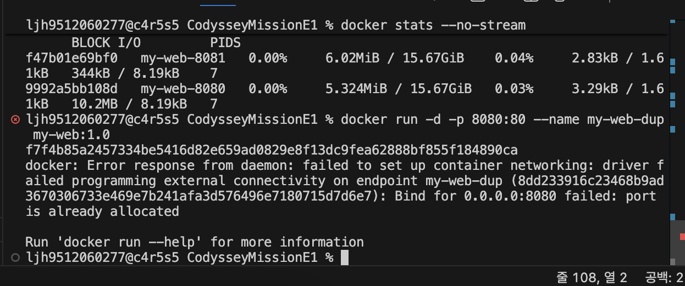
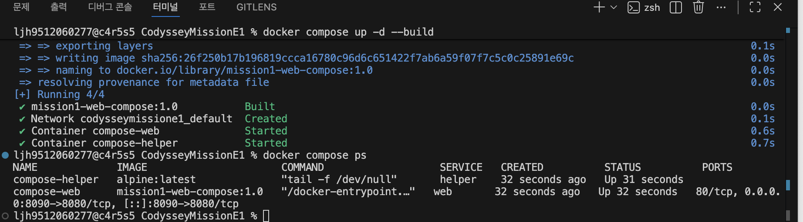
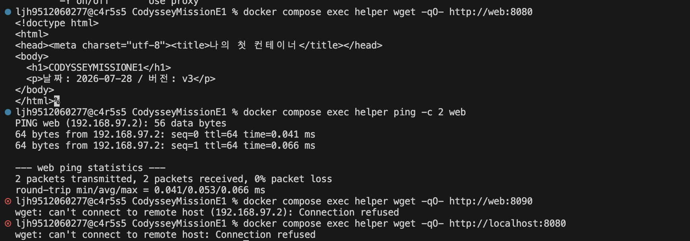
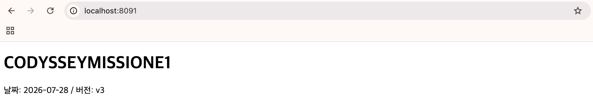
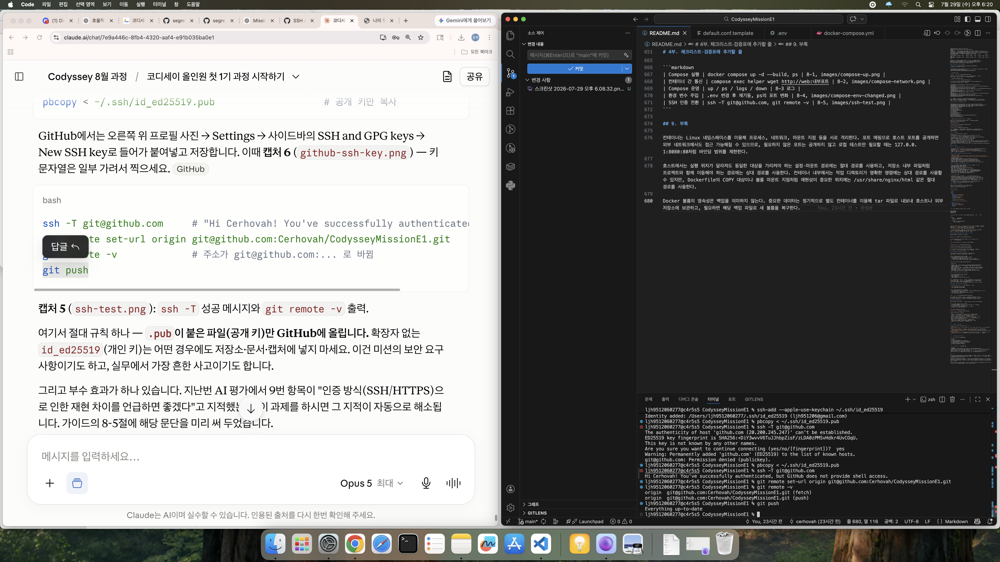
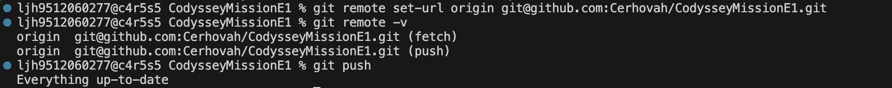

# 개발 워크스테이션 구축 미션

## 1. 프로젝트 개요

터미널, Docker, Git/GitHub를 직접 설정하며, 어떤 컴퓨터에서든 같은 방식으로 재현되는
개발 환경을 만드는 것이 이 미션의 목표다.
정적 웹 서버를 컨테이너로 만들어 포트 매핑, 바인드 마운트, 볼륨 영속성을
실행 결과(로그·접속 화면·데이터 유지)로 직접 검증했고,
수행 중 실제로 발생한 오류 5건을 원인 분석과 함께 기록했다.
보너스 과제로 Docker Compose 4종과 GitHub SSH 키 설정까지 수행했다.
모든 명령·출력·화면 증거는 이 문서에서 확인할 수 있다.

## 2. 실행 환경

- OS: macOS 15.7.4
- Shell: zsh
- Docker: 28.5.2 (build ecc6942), Docker Compose v2.40.3
- Git: 2.53.0
- 비고: 캠퍼스 보안 정책상 sudo 권한 제한 → OrbStack으로 Docker 엔진 구동
  (터미널에서는 일반 환경과 동일하게 docker 명령 사용)

## 3. 빠른 재현 절차

평가자가 이 저장소만으로 결과를 확인할 수 있도록 최소 재현 절차를 먼저 정리한다.
사전 조건은 Docker 엔진이 실행 중일 것(OrbStack 또는 Docker Desktop)뿐이다.

```bash
# 1) 저장소 내려받기
git clone https://github.com/Cerhovah/CodysseyMissionE1.git
cd CodysseyMissionE1

# 2) 커스텀 이미지 빌드 및 실행 (필수 과제 범위)
docker build -t my-web:1.0 .
docker run -d -p 8080:80 --name my-web-8080 my-web:1.0
curl http://localhost:8080          # 페이지 HTML이 응답되면 성공

# 3) 보너스 범위(Compose)까지 확인
docker compose up -d --build
curl http://localhost:8090
docker compose exec helper wget -qO- http://web:8080   # 컨테이너 간 통신
docker compose down

# 4) 정리
docker rm -f my-web-8080
```

포트 8080 또는 8090이 이미 사용 중이라면 `-p` 왼쪽 값 또는 `.env`의 `HOST_PORT`를
비어 있는 번호로 바꾸면 된다.

## 4. 저장소 구조

```
CodysseyMissionE1/
├── README.md                        # 본 기술 문서 (모든 로그·증거 수록)
├── Dockerfile                       # 커스텀 이미지 설계도 (nginx:alpine 기반)
├── .dockerignore                    # 빌드 컨텍스트에서 제외할 항목
├── docker-compose.yml               # 보너스: 두 서비스 실행 설정
├── .env                             # 보너스: 포트·모드 설정값 (비밀값 없음)
├── .gitignore                       # .DS_Store 등 제외
├── site/
│   └── index.html                   # 컨테이너가 서비스하는 정적 페이지
├── templates/
│   └── default.conf.template        # 보너스: 포트를 변수로 뺀 nginx 설정 틀
├── hello.sh                         # 권한 실습에 사용한 한 줄 스크립트
├── practice/                        # 터미널 기본 조작 실습용 폴더
└── images/                          # 실행 화면 증거 (본 문서에서 참조)
```

## 5. 수행 체크리스트

### 필수 과제

- [x] 터미널 기본 조작(위치/목록/이동/생성/복사/이름변경/삭제/내용확인/빈파일)
- [x] 권한 변경 실습(파일 1개 + 디렉토리 1개, 전/후 비교)
- [x] Docker 설치·데몬 점검(version / info)
- [x] Docker 운영 명령(images / ps / ps -a / logs / stats)
- [x] hello-world 및 ubuntu 컨테이너 실습(attach / exec 종료·유지 차이 직접 검증)
- [x] Dockerfile 직접 작성 → 커스텀 이미지 빌드/실행
- [x] 포트 매핑 접속 증거(2개 포트, 주소창 포함)
- [x] 바인드 마운트 변경 전/후 비교(화면 + 텍스트 로그)
- [x] 볼륨 영속성(컨테이너 삭제 전/후) 검증
- [x] Git 설정(git config --list) + GitHub·VSCode 연동

### 보너스 과제 (선택)

- [x] Docker Compose 기초 — 단일 파일로 실행 설정 문서화
- [x] Compose 멀티 컨테이너 — 컨테이너 간 통신 확인
- [x] Compose 운영 명령 — up / ps / logs / down
- [x] 환경 변수 주입으로 포트·모드 변경
- [x] GitHub SSH 키 설정 및 푸시 확인

## 6. 수행 로그

> 로그는 실제 터미널 기록에서 발췌한 것이다. 명령을 잘못 입력해 다시 친 줄
> (예: 명령어 오타로 `command not found`가 난 줄)은 제외했고,
> 실습에 의미가 있는 오류(권한 거부, 포트 충돌, 인증 실패 등)는 그대로 남겼다.
>
> 개인정보 보호를 위해 계정명과 홈 경로는 `[user]`, `[host]`로 치환했고
> 이메일 주소는 일부를 가렸다. 명령과 출력 내용 자체는 실행 결과 그대로다.

### 6-1. 터미널 기본 조작

```
[user]@[host] CodysseyMissionE1 % pwd
/Users/[user]/CodysseyMissionE1
[user]@[host] CodysseyMissionE1 % ls -la
total 8
drwxr-xr-x   4 [user]  [user]   128  7 28 13:34 .
drwxr-x---+ 25 [user]  [user]   800  7 28 13:40 ..
drwxr-xr-x  15 [user]  [user]   480  7 28 13:40 .git
-rw-r--r--   1 [user]  [user]  3162  7 28 13:39 README.md
[user]@[host] CodysseyMissionE1 % mkdir images
[user]@[host] CodysseyMissionE1 % mkdir practice
[user]@[host] CodysseyMissionE1 % cd practice
[user]@[host] practice % touch memo.txt
[user]@[host] practice % cat memo.txt
[user]@[host] practice % cp memo.txt memo_copy.txt
[user]@[host] practice % mv memo_copy.txt note.txt
[user]@[host] practice % ls -la
total 0
drwxr-xr-x  4 [user]  [user]  128  7 28 13:45 .
drwxr-xr-x  6 [user]  [user]  192  7 28 13:45 ..
-rw-r--r--  1 [user]  [user]    0  7 28 13:45 memo.txt
-rw-r--r--  1 [user]  [user]    0  7 28 13:45 note.txt
[user]@[host] practice % rm note.txt
[user]@[host] practice % cd ..
[user]@[host] CodysseyMissionE1 % cd /tmp && pwd
/tmp
[user]@[host] /tmp % cd -
~/CodysseyMissionE1
[user]@[host] CodysseyMissionE1 % cd ./practice && pwd
/Users/[user]/CodysseyMissionE1/practice
```

위 로그의 `cat memo.txt`에 출력이 없는 것은 `touch`로 만든 파일이 비어 있기 때문이다.
파일에 내용이 있을 때도 정상적으로 읽히는지 확인하기 위해 다음을 추가로 수행했다.

```
[user]@[host] CodysseyMissionE1 % cd practice
[user]@[host] practice % echo "hello codyssey" > memo.txt
[user]@[host] practice % cat memo.txt
hello codyssey
[user]@[host] practice % ls -l memo.txt
-rw-r--r--  1 [user]  [user]  15  7 29 18:47 memo.txt
[user]@[host] practice % cd ..
```

`>`는 명령의 출력을 화면 대신 파일로 보내는 기호이며, 기존 내용을 덮어쓴다.
`cat`으로 내용이 출력되는 것과 별개로 `ls -l`의 크기가 0에서 15바이트로 바뀐 것까지
확인해, 화면 표시가 아니라 파일에 실제로 저장되었음을 검증했다.

절대 경로는 `/`부터 시작하는 전체 주소이고, 상대 경로는 현재 위치 기준의 길 안내다.
`/tmp`는 어디서 입력해도 같은 곳으로 이동하지만, `./practice`는 서 있는 위치에 따라
결과가 달라진다. 위 로그의 `cd /tmp`(절대)와 `cd ./practice`(상대)가 그 예시다.

선택 기준(재현성 관점): 호스트에서는 사용자마다 홈 경로가 다르므로 절대 경로를 문서에
고정하면 재현이 깨진다. 그래서 마운트 명령에는 `$(pwd)`처럼 실행 시점에 절대 경로를
만들어 쓰는 방식을 사용했다. Docker의 `-v`는 호스트 쪽에 절대 경로를 요구하며,
`/`로 시작하지 않으면 경로가 아니라 볼륨 이름으로 해석하기 때문이다.
반대로 컨테이너 내부는 이미지가 디렉토리 구조를 고정하므로
`/usr/share/nginx/html`처럼 절대 경로로 지정하는 것이 명확하다.

### 6-2. 권한 실습 (전/후 비교)

실행 권한이 없는 스크립트를 실행하면 거부되는 것을 먼저 확인하고,
권한 부여 후 성공하는 과정을 기록했다.

```
[user]@[host] CodysseyMissionE1 % echo 'echo "실행 성공!"' > hello.sh
[user]@[host] CodysseyMissionE1 % ./hello.sh
zsh: permission denied: ./hello.sh
[user]@[host] CodysseyMissionE1 % chmod 755 hello.sh
[user]@[host] CodysseyMissionE1 % ./hello.sh
실행 성공!
[user]@[host] CodysseyMissionE1 % mkdir secret
[user]@[host] CodysseyMissionE1 % chmod 644 secret
[user]@[host] CodysseyMissionE1 % cd secret
cd: permission denied: secret
[user]@[host] CodysseyMissionE1 % chmod 755 secret
[user]@[host] CodysseyMissionE1 % cd secret && cd ..
[user]@[host] CodysseyMissionE1 % rm -r secret
```


권한 표기의 변경 전/후는 `ls -l`(파일)과 `ls -ld`(디렉토리)로 확인했다.
`ls -l`은 파일의 상세 정보를, `ls -ld`는 디렉토리 자체의 정보를 보여 준다
(`-d` 없이 디렉토리에 쓰면 그 안의 내용 목록이 나온다).

```
[user]@[host] CodysseyMissionE1 % chmod 644 hello.sh
[user]@[host] CodysseyMissionE1 % ls -l hello.sh
-rw-r--r--  1 [user]  [user]  22  7 28 14:01 hello.sh
[user]@[host] CodysseyMissionE1 % chmod 755 hello.sh
[user]@[host] CodysseyMissionE1 % ls -l hello.sh
-rwxr-xr-x  1 [user]  [user]  22  7 28 14:01 hello.sh
[user]@[host] CodysseyMissionE1 % mkdir secret
[user]@[host] CodysseyMissionE1 % ls -ld secret
drwxr-xr-x  2 [user]  [user]  64  7 28 16:13 secret
[user]@[host] CodysseyMissionE1 % chmod 644 secret
[user]@[host] CodysseyMissionE1 % ls -ld secret
drw-r--r--  2 [user]  [user]  64  7 28 16:13 secret
[user]@[host] CodysseyMissionE1 % chmod 755 secret
[user]@[host] CodysseyMissionE1 % ls -ld secret
drwxr-xr-x  2 [user]  [user]  64  7 28 16:13 secret
[user]@[host] CodysseyMissionE1 % rm -r secret
```

권한은 소유자·그룹·그 외 세 부류에 대해 읽기 r=4, 쓰기 w=2, 실행 x=1을 더한
숫자로 표기한다. 755는 "소유자는 전부(rwx), 나머지는 읽기와 실행만(r-x)",
644는 "소유자는 읽고 쓰기(rw-), 나머지는 읽기만(r--)"이라는 뜻이다.
디렉토리에서 실행(x) 권한은 "그 안으로 들어갈 수 있음"을 의미하며,
위 로그에서 644로 낮춘 폴더에 `cd`가 거부되고, 755로 되돌리자 들어가진 것이 그 증거다.
맨 앞 한 글자는 종류를 뜻해 파일은 `-`, 디렉토리는 `d`로 표시된다.

대상별 권한 선택 기준: 직접 실행해야 하는 스크립트에는 실행 권한이 필요하므로 755를,
읽히기만 하면 되는 정적 파일(HTML, 설정 등)에는 644를 사용했다.
실행 권한은 필요할 때만 부여하는 것이 안전하다.

### 6-3. Docker 설치·점검

```
[user]@[host] CodysseyMissionE1 % docker --version
Docker version 28.5.2, build ecc6942
[user]@[host] CodysseyMissionE1 % docker info
Client:
 Version:    28.5.2
 Context:    orbstack
 Debug Mode: false
(…중략…)
Server:
 Containers: 1
  Running: 0
  Paused: 0
  Stopped: 1
 Images: 2
 Server Version: 28.5.2
 Storage Driver: overlay2
 Kernel Version: 6.17.8-orbstack-00308-g8f9c941121b1
 Operating System: OrbStack
 OSType: linux
 Architecture: x86_64
 CPUs: 6
 Total Memory: 15.67GiB
(…이하 네트워크 풀 등 상세 출력 중략…)
```

데몬 상태 요약: `docker info`가 오류 없이 **Server** 항목을 출력했고
Server Version(28.5.2), Containers, Images 값이 정상 표시되므로 Docker 데몬이
동작 중임을 확인했다. Context가 `orbstack`으로 표시되어, sudo 없이 OrbStack이
엔진을 구동하고 있음도 함께 확인된다. 데몬이 꺼져 있으면 이 명령은 정보 대신
`Cannot connect to the Docker daemon` 오류를 낸다.

### 6-4. 컨테이너 실습 (hello-world / ubuntu / attach·exec 차이)

```
[user]@[host] CodysseyMissionE1 % docker run hello-world

Hello from Docker!
This message shows that your installation appears to be working correctly.

To generate this message, Docker took the following steps:
 1. The Docker client contacted the Docker daemon.
 2. The Docker daemon pulled the "hello-world" image from the Docker Hub.
    (amd64)
 3. The Docker daemon created a new container from that image which runs the
    executable that produces the output you are currently reading.
 4. The Docker daemon streamed that output to the Docker client, which sent it
    to your terminal.
(…이하 안내문 중략…)

[user]@[host] CodysseyMissionE1 % docker images
REPOSITORY    TAG       IMAGE ID       CREATED        SIZE
ubuntu        latest    de7345b16e94   2 weeks ago    100MB
hello-world   latest    e2ac70e7319a   4 months ago   10.1kB
[user]@[host] CodysseyMissionE1 % docker ps
CONTAINER ID   IMAGE     COMMAND   CREATED   STATUS    PORTS     NAMES
[user]@[host] CodysseyMissionE1 % docker ps -a
CONTAINER ID   IMAGE         COMMAND    CREATED          STATUS                      PORTS     NAMES
f36c1ebb72ee   hello-world   "/hello"   11 seconds ago   Exited (0) 11 seconds ago             brave_diffie
8a3fc59746c3   hello-world   "/hello"   5 minutes ago    Exited (0) 5 minutes ago              wonderful_shockley
```

실행 전후 상태 연결: `docker run hello-world` 한 번으로
"이미지 내려받기 → 컨테이너 생성 → 실행 → 출력"이라는 기본 회로 전체가 확인된다.
실행 결과로 `docker images`에는 내려받은 설계도(hello-world 이미지)가 남고,
`docker ps`에는 아무것도 없지만 `docker ps -a`에는 실행을 마치고 종료된 컨테이너가
`Exited (0)` 상태로 남는다. 즉 이미지는 창고에 보관되고, 컨테이너는 실행이 끝나도
기록으로 남는다는 점이 두 명령의 출력 차이로 드러난다.
`--name`을 주지 않으면 Docker가 `brave_diffie`처럼 이름을 자동으로 붙인다.

```
[user]@[host] CodysseyMissionE1 % docker run -it --name ub1 ubuntu bash
root@bf4efb8e9425:/# ls /
bin   dev  home  lib64  mnt  proc  run   srv  tmp  var
boot  etc  lib   media  opt  root  sbin  sys  usr
root@bf4efb8e9425:/# echo "running inside container"
running inside container
root@bf4efb8e9425:/# exit
exit
[user]@[host] CodysseyMissionE1 % docker ps -a
CONTAINER ID   IMAGE         COMMAND    CREATED              STATUS                     PORTS     NAMES
bf4efb8e9425   ubuntu        "bash"     About a minute ago   Exited (0) 8 seconds ago             ub1
f36c1ebb72ee   hello-world   "/hello"   2 minutes ago        Exited (0) 2 minutes ago             brave_diffie
8a3fc59746c3   hello-world   "/hello"   8 minutes ago        Exited (0) 8 minutes ago             wonderful_shockley
[user]@[host] CodysseyMissionE1 % docker run -d --name ub2 ubuntu sleep infinity
d8ccc4e382e2d6d4b3da19a499f2d5ba7c3bbabce491c499ddf471c846d5bba8
[user]@[host] CodysseyMissionE1 % docker exec -it ub2 bash
root@d8ccc4e382e2:/# exit
exit
[user]@[host] CodysseyMissionE1 % docker ps
CONTAINER ID   IMAGE     COMMAND            CREATED          STATUS          PORTS     NAMES
d8ccc4e382e2   ubuntu    "sleep infinity"   18 seconds ago   Up 17 seconds             ub2
[user]@[host] CodysseyMissionE1 % docker stats --no-stream
CONTAINER ID   NAME      CPU %     MEM USAGE / LIMIT    MEM %     NET I/O         BLOCK I/O     PIDS
d8ccc4e382e2   ub2       0.00%     1.93MiB / 15.67GiB   0.01%     1.13kB / 126B   14.7MB / 0B   1
```

여기까지 확인된 것은 두 가지다. `run -it`로 들어간 ub1은 내가 곧 컨테이너의 본체
작업이므로 `exit` 시 함께 종료되어 `Exited`로 남았고, 배경 실행(`-d`) 후 `exec`로
들어간 ub2는 별도 프로세스로 들어간 것이라 빠져나와도 `Up` 상태를 유지했다.
`ub2`의 본체 작업을 `sleep infinity`로 준 이유는, 아무 일도 하지 않으면서 컨테이너가
꺼지지 않게 유지하기 위해서다.

`attach`는 위 두 경우와 또 다르므로, 별도 컨테이너(ub3)를 만들어 직접 검증했다.
확인 대상은 "같은 attach라도 빠져나오는 방법에 따라 결과가 달라지는가"이다.
Docker의 기본 분리 키는 Ctrl+P, Ctrl+Q이지만 편집기 통합 터미널이 이 조합을 가로채는
문제가 있어 `--detach-keys="ctrl-x"`로 분리 키를 바꿔 수행했다(트러블슈팅 사례 5).

```
[user]@[host] CodysseyMissionE1 % docker stop ub3
ub3
[user]@[host] CodysseyMissionE1 % docker attach --detach-keys="ctrl-x" ub3
You cannot attach to a stopped container, start it first
[user]@[host] CodysseyMissionE1 % docker start ub3
ub3
[user]@[host] CodysseyMissionE1 % docker attach --detach-keys="ctrl-x" ub3
root@ae0a1020074e:/# echo "attach test"
attach test
root@ae0a1020074e:/# read escape sequence
[user]@[host] CodysseyMissionE1 % docker ps --filter "name=ub3"
CONTAINER ID   IMAGE     COMMAND   CREATED         STATUS          PORTS     NAMES
ae0a1020074e   ubuntu    "bash"    8 minutes ago   Up 37 seconds             ub3
[user]@[host] CodysseyMissionE1 % docker attach --detach-keys="ctrl-x" ub3
root@ae0a1020074e:/# exit
exit
[user]@[host] CodysseyMissionE1 % docker ps -a --filter "name=ub3"
CONTAINER ID   IMAGE     COMMAND   CREATED         STATUS                     PORTS     NAMES
ae0a1020074e   ubuntu    "bash"    9 minutes ago   Exited (0) 5 seconds ago             ub3
```

로그를 읽는 순서는 이렇다. 멈춰 있는 컨테이너에는 붙을 수 없다는 오류로 시작해
(`You cannot attach to a stopped container`), `docker start`로 켠 뒤 붙었다.
컨테이너 안에서 명령을 실행한 다음 분리 키를 누르자 `read escape sequence`가 출력되며
호스트로 돌아왔고, 이때 `docker ps`에는 여전히 `Up 37 seconds`로 살아 있다.
같은 컨테이너에 다시 붙어 이번에는 `exit`을 입력하자 `docker ps -a`에서
`Exited (0)`로 바뀌었다. 분리 키와 `exit`의 결과가 정반대라는 것이 이 실험의 결론이다.

정리: `exec`는 컨테이너에 별도의 프로세스를 새로 띄워 들어가는 방식이라 빠져나와도
컨테이너가 유지된다. `attach`는 컨테이너의 본체 작업에 직접 연결하는 방식이라,
분리 키로 나오면 유지되지만 본체를 종료(`exit`)하면 컨테이너도 함께 종료된다.
운영 중인 컨테이너를 점검할 때 `exec`를 쓰는 이유가 여기에 있다.

### 6-5. 커스텀 이미지 (Dockerfile)

기존 베이스로 경량 웹 서버 이미지인 `nginx:alpine`을 선택했다.
포트 매핑·마운트 검증과 자연스럽게 이어지는 웹 서버라는 점, 용량이 작아
빌드가 빠르다는 점이 선택 이유다. 직접 작성한 Dockerfile은 다음과 같다.

```dockerfile
FROM nginx:alpine
LABEL org.opencontainers.image.title="mission1-web"
ENV APP_ENV=dev
COPY site/ /usr/share/nginx/html/
```

커스텀 포인트와 각각의 목적:

1. `LABEL` — 이미지에 이름표를 붙여 무엇을 위한 이미지인지 식별 가능하게 함
2. `ENV` — 환경 변수를 심어 설정과 코드를 분리하는 구조를 연습
3. `COPY` — nginx 기본 페이지를 직접 만든 정적 페이지(site/)로 교체

`COPY`의 목적지 `/usr/share/nginx/html/`은 nginx가 웹 페이지를 찾는 기본 위치이며,
이 경로에 파일을 넣는 것만으로 기본 환영 페이지가 교체된다.

이미지 태그 규칙: `my-web:1.0`처럼 "이름:버전" 형식을 사용했다.
기능이 추가되면 1.1, 기존 사용 방식이 깨지면 2.0으로 올린다는 기준이며,
`latest`는 어느 시점의 이미지인지 특정되지 않아 재현성이 떨어지므로 사용하지 않았다.

빌드 컨텍스트(빌드 시 Docker에 전달되는 파일 묶음)를 줄이고 이미지에 불필요한 파일이
들어가지 않도록 `.dockerignore`를 두었다.

빌드 로그:

```
[user]@[host] CodysseyMissionE1 % docker build -t my-web:1.0 .
[+] Building 1.4s (7/7) FINISHED                                   docker:orbstack
 => [internal] load build definition from Dockerfile                          0.1s
 => [internal] load metadata for docker.io/library/nginx:alpine               0.8s
 => [internal] load .dockerignore                                             0.1s
 => [internal] load build context                                             0.1s
 => [1/2] FROM docker.io/library/nginx:alpine@sha256:4a73073bd557c65b759505d  0.0s
 => CACHED [2/2] COPY site/ /usr/share/nginx/html/                            0.0s
 => exporting to image                                                        0.1s
 => => naming to docker.io/library/my-web:1.0                                 0.0s
```

명령 끝의 점(`.`)은 "현재 폴더를 빌드 재료로 사용하라"는 뜻이다.
`CACHED`는 이전 빌드와 동일한 단계를 다시 굽지 않고 재사용했다는 표시다.
따라서 `site/` 내용을 바꾼 뒤 이미지에 반영하려면 다시 빌드해야 하며,
빌드 없이 즉시 반영이 필요할 때는 6-7의 바인드 마운트를 사용한다.

### 6-6. 포트 매핑 접속 증거

같은 이미지로 컨테이너 두 개를 서로 다른 포트(8080, 8081)에 실행하고,
curl과 브라우저 양쪽에서 접속을 확인했다.
`-p 8080:80`에서 콜론 왼쪽은 호스트(내 컴퓨터) 포트, 오른쪽은 컨테이너 안에서
nginx가 실제로 듣고 있는 포트다.

```
[user]@[host] CodysseyMissionE1 % docker run -d -p 8080:80 --name my-web-8080 my-web:1.0
9992a5bb108dd8fd73aa7997779d9b8242e2e4f8abf1a197773c5fe3f0ba66b8
[user]@[host] CodysseyMissionE1 % curl http://localhost:8080
<!doctype html>
<html>
<head><meta charset="utf-8"><title>나의 첫 컨테이너</title></head>
<body>
  <h1>CODYSSEYMISSIONE1/h1>
  <p>날짜: 2026-07-28 / 버전: v1</p>
</body>
</html>
[user]@[host] CodysseyMissionE1 % docker run -d -p 8081:80 --name my-web-8081 my-web:1.0
f47b01e69bf0151decb213b7d43e9ab079b3b3def38582b3d7537ad9c9f9cbce
[user]@[host] CodysseyMissionE1 % curl http://localhost:8081
<!doctype html>
<html>
<head><meta charset="utf-8"><title>나의 첫 컨테이너</title></head>
<body>
  <h1>CODYSSEYMISSIONE1/h1>
  <p>날짜: 2026-07-28 / 버전: v1</p>
</body>
</html>
```

> 위 응답의 `/h1>` 표기는 당시 index.html의 닫는 태그 오타로,
> 상세 내용과 해결 과정은 트러블슈팅 사례 3에 기록했다.

브라우저 접속 화면(주소창 포함):


접속 흔적은 컨테이너 로그와 자원 사용량으로도 확인했다.

```
[user]@[host] CodysseyMissionE1 % docker logs my-web-8080
/docker-entrypoint.sh: Configuration complete; ready for start up
2026/07/28 06:26:20 [notice] 1#1: nginx/1.31.3
2026/07/28 06:26:20 [notice] 1#1: start worker processes
(…중략…)
192.168.215.1 - - [28/Jul/2026:06:26:32 +0000] "GET / HTTP/1.1" 200 188 "-" "curl/8.7.1" "-"
192.168.215.1 - - [28/Jul/2026:06:26:45 +0000] "GET / HTTP/1.1" 304 0 "-" "Mozilla/5.0 (Macintosh; Intel Mac OS X 10_15_7) AppleWebKit/537.36 (KHTML, like Gecko) Chrome/146.0.0.0 Safari/537.36" "-"
[user]@[host] CodysseyMissionE1 % docker stats --no-stream
CONTAINER ID   NAME          CPU %     MEM USAGE / LIMIT     MEM %     NET I/O           BLOCK I/O         PIDS
f47b01e69bf0   my-web-8081   0.00%     6.02MiB / 15.67GiB    0.04%     2.83kB / 1.61kB   344kB / 8.19kB    7
9992a5bb108d   my-web-8080   0.00%     5.324MiB / 15.67GiB   0.03%     3.29kB / 1.61kB   10.2MB / 8.19kB   7
```

로그 마지막 두 줄은 접속 기록이다. `GET /`은 대문 페이지 요청, `200`은 성공,
`304`는 "이전과 내용이 같으니 갖고 있는 것을 쓰라"는 응답이며, 줄 끝의 `curl`과
`Chrome` 표기로 각각 명령줄과 브라우저에서 들어온 요청임을 구분할 수 있다.

컨테이너는 격리된 실행 공간이라 바깥에서 직접 접근할 수 없고, 호스트 포트와
컨테이너 포트를 연결(매핑)해야 접속이 된다. 이 격리는 리눅스 커널의 네임스페이스
기능으로 구현되며, 프로세스·네트워크·파일 구조 목록을 컨테이너마다 별도로 부여한다.
각 컨테이너가 자기만의 80번 포트를 가질 수 있는 것(두 nginx가 충돌하지 않은 이유)과,
바깥에서 접근하려면 매핑이 필요한 것(포트 매핑이 필요한 이유)이 모두 여기서 나온다.
같은 이미지 하나로 8080과 8081에 두 개를 나란히 띄울 수 있는 것 자체가
격리와 포트 매핑의 증명이다.

보안 관점 주의: `-p 8080:80`은 `docker ps` 출력의 `0.0.0.0:8080` 표기처럼
모든 네트워크 통로에 포트를 공개하므로, 같은 네트워크의 다른 기기에서도 접근될 수 있다.
로컬 테스트만 필요하면 `-p 127.0.0.1:8080:80`으로 내 컴퓨터 안에서만 열리도록
제한하는 것이 안전하다.

### 6-7. 바인드 마운트 / 볼륨 영속성

**바인드 마운트** — 호스트의 `site` 폴더를 컨테이너의 웹 루트에 연결해,
파일 수정이 즉시 반영되는지 확인했다.

```
[user]@[host] CodysseyMissionE1 % docker run -d -p 8082:80 --name my-web-live -v "$(pwd)/site:/usr/share/nginx/html" nginx:alpine
c18ba5971f366ccf8c91486b9c159170ec5d04bdad2bd13e091e8980d5f8c1ba
```

`-v` 뒤의 값은 "호스트 경로:컨테이너 경로" 형식이며, `$(pwd)`는 명령을 실행한 시점의
현재 폴더를 절대 경로로 바꿔 넣는 표기다.

변경 전(버전 v2 상태):


호스트에서 index.html을 수정(버전 v2 → v3, 닫는 태그 오타 수정)하고 저장한 뒤,
이미지를 다시 빌드하지 않고 새로고침만으로 반영을 확인했다.

변경 후(버전 v3, 오타 수정 반영):


화면 증거만으로는 "어떤 명령으로 수정했는지"가 남지 않으므로,
같은 검증을 명령과 응답 텍스트로도 다시 수행했다.

```
[user]@[host] CodysseyMissionE1 % pwd
/Users/[user]/CodysseyMissionE1
[user]@[host] CodysseyMissionE1 % docker ps -a --filter "name=my-web-live"
CONTAINER ID   IMAGE          COMMAND                   CREATED        STATUS         PORTS                                     NAMES
c18ba5971f36   nginx:alpine   "/docker-entrypoint.…"   28 hours ago   Up 7 minutes   0.0.0.0:8082->80/tcp, [::]:8082->80/tcp   my-web-live
[user]@[host] CodysseyMissionE1 % curl -s http://localhost:8082 | grep 버전
  <p>날짜: 2026-07-28 / 버전: v3</p>
[user]@[host] CodysseyMissionE1 % sed -i '' 's/버전: v3/버전: v4/' site/index.html
[user]@[host] CodysseyMissionE1 % curl -s http://localhost:8082 | grep 버전
  <p>날짜: 2026-07-28 / 버전: v4</p>
[user]@[host] CodysseyMissionE1 % sed -i '' 's/버전: v4/버전: v3/' site/index.html
[user]@[host] CodysseyMissionE1 % curl -s http://localhost:8082 | grep 버전
  <p>날짜: 2026-07-28 / 버전: v3</p>
[user]@[host] CodysseyMissionE1 % docker inspect my-web-live --format '{{json .Mounts}}'
[{"Type":"bind","Source":"/Users/[user]/CodysseyMissionE1/site","Destination":"/usr/share/nginx/html","Mode":"","RW":true,"Propagation":"rprivate"}]
```

사용한 표기의 뜻은 다음과 같다.
`curl -s`는 진행률 표시를 감추고 응답 본문만 받는 옵션이고,
`|`(파이프)는 왼쪽 명령의 출력을 오른쪽 명령의 입력으로 넘기는 기호라
`grep 버전`이 응답 중 '버전'이 들어간 줄만 걸러 준다.
`sed -i '' 's/찾을문자/바꿀문자/' 파일`은 파일 안의 문자열을 직접 치환하는 명령이며,
`-i` 뒤의 빈 따옴표는 백업 파일을 만들지 않겠다는 macOS 표기다.

핵심은 이미지를 다시 빌드하거나 컨테이너를 재시작하지 않았는데도 응답이
v3 → v4 → v3으로 따라 바뀌었다는 점이다. 마지막 `docker inspect` 결과의
`"Type":"bind"`와 Source/Destination 값이 호스트 폴더와 컨테이너 경로가 실제로
연결되어 있음을 보여 준다. 문서와 화면 증거의 상태를 일치시키기 위해
검증 후 파일은 v3으로 되돌렸다.

**볼륨 영속성** — 볼륨을 만들어 컨테이너에 연결하고, 컨테이너를 완전히 삭제한 뒤
새 컨테이너에서 데이터가 살아 있는지 확인했다.

```
[user]@[host] CodysseyMissionE1 % docker volume create mission-data
mission-data
[user]@[host] CodysseyMissionE1 % docker run -d --name keeper -v mission-data:/data ubuntu sleep infinity
0edd0d93076b8b4fbf775750b0755b4c4277743d6ae0e1229f81ebb86089320f
[user]@[host] CodysseyMissionE1 % docker exec keeper bash -c "echo '컨테이너가 삭제되어도 남는 기록' > /data/proof.txt"
[user]@[host] CodysseyMissionE1 % docker exec keeper cat /data/proof.txt
컨테이너가 삭제되어도 남는 기록
[user]@[host] CodysseyMissionE1 % docker rm -f keeper
keeper
[user]@[host] CodysseyMissionE1 % docker run -d --name keeper2 -v mission-data:/data ubuntu sleep infinity
1b35dfd8cbf4e971371478ad02f40d9ede0a5cddc29041c8862887f62d57e3f2
[user]@[host] CodysseyMissionE1 % docker exec keeper2 cat /data/proof.txt
컨테이너가 삭제되어도 남는 기록
```

`-v mission-data:/data`는 바인드 마운트와 형식은 같지만 콜론 왼쪽이 폴더 경로가 아니라
볼륨 이름이라는 점이 다르다. `docker rm -f`는 실행 중인 컨테이너도 강제로 삭제한다.

볼륨은 도커가 관리하는 별도 저장 공간이라 컨테이너보다 오래 산다.
keeper를 삭제했는데도 keeper2에서 같은 데이터가 읽히는 마지막 출력이 그 증거다.
바인드 마운트는 개발 편의(수정 즉시 반영)용, 볼륨은 데이터 보존용이라는 점이 둘의 차이다.

관리 관점 보완(백업): 볼륨의 영속성은 백업을 의미하지 않는다. 볼륨은 도커 관리 영역에
저장되므로, 임시 컨테이너를 볼륨과 현재 폴더에 동시에 연결해 압축 파일로 꺼내는 방식으로
백업할 수 있다.

```bash
docker run --rm -v mission-data:/data -v "$(pwd)":/backup ubuntu \
  tar czf /backup/mission-data-backup.tgz -C /data .
```

`--rm`은 작업이 끝나면 컨테이너가 스스로 사라지게 하는 옵션이다.
복구할 때는 새 볼륨을 만들고 같은 방식으로 `tar xzf`를 실행하면 된다.

### 6-8. Git 설정 및 GitHub·VSCode 연동

```
[user]@[host] CodysseyMissionE1 % git config --global user.name "cerhovah"
[user]@[host] CodysseyMissionE1 % git config --global user.email "lj*****@gmail.com"
[user]@[host] CodysseyMissionE1 % git config --global init.defaultBranch main
[user]@[host] CodysseyMissionE1 % git config --list
credential.helper=osxkeychain
user.name=cerhovah
user.email=lj*****@gmail.com
init.defaultbranch=main
core.repositoryformatversion=0
core.filemode=true
core.bare=false
core.logallrefupdates=true
core.ignorecase=true
core.precomposeunicode=true
remote.origin.url=https://github.com/Cerhovah/CodysseyMissionE1.git
branch.main.remote=origin
branch.main.merge=refs/heads/main
```

`--global`은 이 컴퓨터의 모든 저장소에 적용되는 설정이라는 뜻이고,
`init.defaultBranch main`은 새로 만드는 저장소의 기본 갈래(브랜치) 이름을 정한다.
출력의 `remote.origin.url`은 이 저장소가 연결된 원격 주소이며,
`branch.main.remote=origin`은 로컬 main 갈래가 그 원격과 짝지어져 있다는 뜻이다.

GitHub 저장소를 VSCode로 복제(clone)하여 작업했고, 편집기에서 GitHub 계정으로
로그인한 상태에서 커밋·푸시가 GitHub에 정상 반영되는 것으로 연동을 확인했다.

VSCode 계정 연동 화면:


푸시 후 GitHub 커밋 반영 화면:


단계별로 작업을 나눠 커밋했으므로, 이 저장소의 커밋 이력 자체가 수행 순서와
변경 내역에 대한 추가 증거가 된다(저장소 상단의 Commits에서 확인 가능).
SSH 방식으로 전환한 뒤의 실제 전송 로그는 10-5에 있다.

Git은 내 컴퓨터에서 변경 이력을 기록·되돌리기 하는 도구이고, GitHub는 그 기록을
올려 공유·협업하는 원격 플랫폼이다. 인증 방식은 처음 HTTPS로 시작해 보너스 과제에서
SSH로 전환했으며, 그 차이는 10-5에 정리했다.

## 7. 검증 방법 요약

| 확인 대상 | 사용한 명령/방법 | 결과 위치 |
|---|---|---|
| 터미널 기본 조작 | pwd, ls -la, mkdir, cp, mv, rm, cat, touch | 6-1 |
| 파일 내용 확인 | echo로 내용 작성 후 cat, ls -l로 크기 확인 | 6-1 |
| 절대/상대 경로 | cd /tmp ↔ cd ./practice 비교 | 6-1 |
| 권한 전/후 | ls -l / ls -ld, chmod 644·755 | 6-2, images/permission-denied.png |
| Docker 데몬 동작 | docker --version, docker info | 6-3 |
| 컨테이너 상태/자원 | docker ps, ps -a, stats | 6-4, 6-6 |
| attach / exec 차이 | attach 후 분리 키 vs exit 비교 | 6-4 |
| 이미지 빌드 | docker build -t my-web:1.0 . | 6-5 |
| 웹 접속(포트 매핑) | curl, 브라우저, docker logs | 6-6, images/port-8080.png, port-8081.png |
| 마운트 반영 | 파일 수정 후 curl 응답 변화, docker inspect | 6-7, images/mount-before.png, mount-after.png |
| 볼륨 영속성 | 컨테이너 삭제 전/후 cat | 6-7 |
| GitHub 연동 | git config --list, 커밋 이력 반영 확인 | 6-8, images/vscode-github.png, github-commits.png |
| Compose 실행 | docker compose up -d --build, ps | 10-1, images/compose-up.png |
| 컨테이너 간 통신 | compose exec helper wget http://web:8080 | 10-2, images/compose-network.png |
| Compose 운영 | up / ps / logs / down | 10-3 |
| 환경 변수 주입 | .env 변경 후 재기동, ps의 포트 변화 | 10-4, images/compose-web-8091.png |
| SSH 인증 전환 | ssh -T git@github.com, git remote -v, git push | 10-5, images/ssh-auth.png, ssh-remote-push.png |

## 8. 트러블슈팅

### 사례 1: 스크립트 실행 시 권한 거부

- 문제(오류 문구 원문): `zsh: permission denied: ./hello.sh` (images/permission-denied.png)
- 원인 가설: 새로 만든 파일에는 실행 권한이 없어(기본 644) 실행이 거부된다.
- 확인(사용한 명령): `ls -l hello.sh`로 권한이 `rw-r--r--`(644)이며 x가 없음을 확인.
- 해결/대안: `chmod 755 hello.sh`로 실행 권한을 부여.
- 검증: 재실행 시 `실행 성공!`이 출력되고 `ls -l`이 `-rwxr-xr-x`로 바뀐 것을 확인(6-2).

### 사례 2: 동일 포트 중복 사용으로 컨테이너 실행 실패

- 문제(오류 문구 원문):
  `docker: Error response from daemon: failed to set up container networking: driver failed programming external connectivity on endpoint my-web-dup (…): Bind for 0.0.0.0:8080 failed: port is already allocated`



- 원인 가설: 호스트의 한 포트(8080)는 동시에 하나만 점유할 수 있는데,
  이미 my-web-8080이 8080을 쓰는 상태에서 같은 포트로 실행을 시도했다.
- 확인(사용한 명령): `docker ps`로 8080이 my-web-8080에 매핑되어 있음을 확인.
  컨테이너가 아닌 호스트 프로그램이 점유한 경우까지 확인하려면
  macOS/리눅스에서는 `lsof -i :8080`을 사용한다.
- 해결/대안: 시작에 실패한 컨테이너를 `docker rm my-web-dup`으로 정리하고,
  추가 실행에는 8081처럼 비어 있는 포트를 사용(`-p` 왼쪽 값 변경).
- 검증: 8081로 실행한 컨테이너가 `Up` 상태가 되고 `curl http://localhost:8081`이
  정상 응답하는 것을 확인(6-6).

### 사례 3: 웹 화면에 "/h1>" 문자가 그대로 노출

- 문제: 브라우저와 curl 응답의 제목 옆에 `/h1>`이라는 글자가 그대로 표시됨
  (images/port-8080.png 등에서 확인 가능).
- 원인 가설: HTML 닫는 태그의 문법 오류.
- 확인: `site/index.html` 5행이 `<h1>CODYSSEYMISSIONE1/h1>`로,
  닫는 태그의 `<`가 누락된 것을 확인. 브라우저는 태그로 인식하지 못한 문자열을
  그대로 화면에 출력한다.
- 해결/대안: `</h1>`로 수정하고 버전 표기를 v3으로 갱신.
- 검증: 바인드 마운트로 연결된 8082 컨테이너에서 새로고침만으로 수정이 반영되어
  `/h1>` 표기가 사라진 것을 확인(images/mount-after.png).
  반면 이미지 빌드 기반의 8080·8081 캡처에는 수정 전 화면이 남아 있는데,
  이는 "이미지는 빌드 시점의 파일을 담는다"는 성질을 보여주는 부수적 증거이기도 하다.
  이미지 쪽에도 반영하려면 `docker build`를 다시 실행해야 한다.

### 사례 4: SSH 연결 시 공개 키 인증 거부

- 문제(오류 문구 원문): `git@github.com: Permission denied (publickey).`
  (images/ssh-auth.png)
- 원인 가설: 열쇠 한 쌍을 만들고 로컬 에이전트에 등록까지 했지만,
  공개 키를 GitHub 계정에 등록하기 전에 연결을 시도했다.
- 확인: `ssh-add` 출력으로 개인 키가 에이전트에 등록된 것은 확인되었으나,
  GitHub의 SSH keys 목록에는 해당 공개 키가 없는 상태였다.
- 해결/대안: `pbcopy < ~/.ssh/id_ed25519.pub`로 공개 키를 복사해
  GitHub → Settings → SSH and GPG keys에 등록한 뒤 재시도.
- 검증: `ssh -T git@github.com`이
  `Hi Cerhovah! You've successfully authenticated...`를 출력하고,
  원격 주소를 SSH로 바꾼 뒤 `git push`가 정상 동작하는 것을 확인(10-5).

### 사례 5: attach 분리 키(Ctrl+P, Ctrl+Q)가 동작하지 않음

- 문제: `docker attach`로 컨테이너에 붙은 뒤 기본 분리 키인 Ctrl+P, Ctrl+Q를
  눌러도 호스트로 돌아오지 않고 컨테이너 프롬프트(`root@…:/#`)가 유지되었다.
  그 상태에서 입력한 명령이 호스트가 아닌 컨테이너 안에서 실행되었다.
- 원인 가설: 편집기의 통합 터미널이 Ctrl+P를 자체 단축키로 가로채어
  Docker 클라이언트까지 신호가 전달되지 않았다.
- 확인: 새 터미널 탭에서 `docker ps --filter "name=ub3"`로 컨테이너가 여전히
  `Up` 상태이고, 기존 탭만 붙어 있는 상태임을 확인.
- 해결/대안: Docker가 제공하는 분리 키 변경 옵션을 사용해
  `docker attach --detach-keys="ctrl-x" ub3`로 실행. 충돌하지 않는 조합으로 바꾸면
  Ctrl+X 한 번으로 분리된다.
- 검증: 분리 시 `read escape sequence`가 출력되며 호스트 프롬프트로 돌아왔고,
  `docker ps`에서 컨테이너가 `Up`으로 유지된 것을 확인(6-4).

## 9. 재현 시 주의사항

- 로그의 계정명·홈 경로는 `[user]`, `[host]`로 치환했다. 다른 환경에서는 각자의
  계정과 홈 디렉토리로 읽으면 되고, 명령 자체는 동일하다.
- `$(pwd)`는 macOS/리눅스 셸 표기이며, Windows PowerShell에서는 `${PWD}`를 사용한다.
- `sed -i ''`는 macOS(BSD sed) 표기이며, 리눅스(GNU sed)에서는 `sed -i`로 쓴다.
- docker 명령 실행 전 OrbStack(일반 환경이라면 Docker Desktop 등)이 켜져 있어야 한다.
  꺼져 있으면 `Cannot connect to the Docker daemon` 오류가 발생한다.
- 8080~8082, 8090~8091 포트가 이미 사용 중인 환경에서는 `-p` 왼쪽 값 또는
  `.env`의 `HOST_PORT`를 다른 번호로 바꾸면 된다(사례 2 참고).
- `docker attach`의 분리 키가 편집기 단축키와 충돌할 수 있으므로,
  필요하면 `--detach-keys` 옵션으로 바꿔 사용한다(사례 5 참고).
- 캠퍼스 환경은 sudo 제한으로 OrbStack을 사용했으나, 본 문서의 docker 명령은
  표준 명령이므로 일반 Docker 환경에서도 동일하게 재현된다.
- 보너스의 SSH 방식은 키를 등록한 환경에서만 동작한다. 키를 등록하지 않은 환경에서는
  3절의 HTTPS 주소로 복제하면 된다.

## 10. 보너스 과제 (선택 수행)

필수 요구사항을 마친 뒤 보너스 과제 5개를 모두 수행했다.
관련 파일은 저장소 루트의 `docker-compose.yml`, `.env`,
`templates/default.conf.template`이다.

### 10-0. 구성 파일

`docker-compose.yml`

```yaml
services:
  web:
    build: .
    image: mission1-web-compose:1.0
    container_name: compose-web
    environment:
      NGINX_PORT: ${NGINX_PORT}
      APP_ENV: ${APP_ENV}
    ports:
      - "${HOST_PORT}:${NGINX_PORT}"
    volumes:
      - ./templates:/etc/nginx/templates:ro

  helper:
    image: alpine:latest
    container_name: compose-helper
    command: tail -f /dev/null
    depends_on:
      - web
```

각 항목의 뜻은 다음과 같다. `build: .`은 현재 폴더의 Dockerfile로 이미지를 직접
굽는다는 뜻이고, `${NGINX_PORT}`처럼 달러와 중괄호로 쓴 값은 `.env` 파일에서 가져온다.
`:ro`는 읽기 전용 연결, `command: tail -f /dev/null`은 아무 일도 하지 않으면서
컨테이너가 꺼지지 않게 유지하는 방법, `depends_on`은 시작 순서 지정이다.

`.env` — 실행 설정을 코드 바깥으로 분리한 파일이다.

```
HOST_PORT=8090
NGINX_PORT=8080
APP_ENV=prod
```

`templates/default.conf.template` — nginx 설정에서 수신 포트만 변수로 뺀 틀이다.

```
server {
    listen       ${NGINX_PORT};
    server_name  localhost;

    location / {
        root   /usr/share/nginx/html;
        index  index.html;
    }
}
```

nginx 공식 이미지는 시작할 때 `/etc/nginx/templates/*.template` 파일의 환경 변수를 채워
`/etc/nginx/conf.d/`로 내보낸다. 덕분에 이미지를 다시 빌드하지 않고 환경 변수만 바꿔
수신 포트를 변경할 수 있다. 이 작업을 수행하는 스크립트가
`20-envsubst-on-templates.sh`이며, 10-3의 로그에서 실제로 실행된 것을 확인할 수 있다.

`.env`에는 비밀값이 없어 재현성을 위해 저장소에 포함했다. 다만 실제 프로젝트에서
`.env`에 토큰·비밀번호가 들어가는 경우에는 `.gitignore`로 제외하고,
값이 빈 `.env.example`만 커밋하는 것이 일반적인 관행이다.

### 10-1. Docker Compose 기초 — 실행 명령을 문서로 옮기기

기존에는 아래처럼 옵션이 붙은 긴 명령을 매번 입력했다.

```
docker run -d -p 8080:80 --name my-web-8080 my-web:1.0
```

같은 실행을 Compose 파일에 적어 두면 옵션이 읽을 수 있는 설정으로 남고,
실행은 짧은 명령 하나가 된다.

```
[user]@[host] CodysseyMissionE1 % docker compose up -d --build
 => => exporting layers                                                       0.1s
 => => writing image sha256:26f250b17b196819ccca16780c96d6c651422f7ab6a59f07f7c5c0c25891e69c  0.0s
 => => naming to docker.io/library/mission1-web-compose:1.0                    0.0s
 => resolving provenance for metadata file                                     0.0s
[+] Running 4/4
 ✔ mission1-web-compose:1.0            Built                                   0.0s
 ✔ Network codysseymissione1_default   Created                                 0.1s
 ✔ Container compose-web               Started                                 0.6s
 ✔ Container compose-helper            Started                                 0.7s
[user]@[host] CodysseyMissionE1 % docker compose ps
NAME             IMAGE                      COMMAND                  SERVICE   CREATED          STATUS          PORTS
compose-helper   alpine:latest              "tail -f /dev/null"      helper    32 seconds ago   Up 31 seconds
compose-web      mission1-web-compose:1.0   "/docker-entrypoint.…"   web       32 seconds ago   Up 32 seconds   80/tcp, 0.0.0.0:8090->8080/tcp, [::]:8090->8080/tcp
```



`up -d`는 배경 실행, `--build`는 실행 전에 이미지를 다시 굽는 옵션이다.
출력의 `Network … Created`에서 보이듯 Compose는 서비스들을 담을 전용 네트워크도
함께 만들어 주는데, 이것이 10-2의 컨테이너 간 통신이 가능한 이유다.

호스트 포트로 접속해 정상 응답을 확인했다.

```
[user]@[host] CodysseyMissionE1 % curl http://localhost:8090
<!doctype html>
<html>
<head><meta charset="utf-8"><title>나의 첫 컨테이너</title></head>
<body>
  <h1>CODYSSEYMISSIONE1</h1>
  <p>날짜: 2026-07-28 / 버전: v3</p>
</body>
</html>
```

`docker compose ps`의 PORTS 열에 `0.0.0.0:8090->8080/tcp`가 표시된 것이,
`.env`의 `HOST_PORT`와 `NGINX_PORT`가 실제 실행에 반영되었다는 증거다.

배움 포인트: 실행 명령이 문서화된 설정으로 바뀌면 옵션을 기억할 필요가 없고,
같은 파일을 받은 사람이 동일한 환경을 그대로 재현할 수 있다.

### 10-2. 멀티 컨테이너와 컨테이너 간 통신

`web`(웹 서버)과 `helper`(점검용 리눅스) 두 서비스를 함께 띄우고,
helper 안에서 서비스 이름으로 web에 접속되는지 확인했다.
성공 사례와 함께, 실패해야 정상인 두 가지 대조 실험도 수행했다.

```
[user]@[host] CodysseyMissionE1 % docker compose exec helper wget -qO- http://web:8080
<!doctype html>
<html>
<head><meta charset="utf-8"><title>나의 첫 컨테이너</title></head>
<body>
  <h1>CODYSSEYMISSIONE1</h1>
  <p>날짜: 2026-07-28 / 버전: v3</p>
</body>
</html>
[user]@[host] CodysseyMissionE1 % docker compose exec helper ping -c 2 web
PING web (192.168.97.2): 56 data bytes
64 bytes from 192.168.97.2: seq=0 ttl=64 time=0.041 ms
64 bytes from 192.168.97.2: seq=1 ttl=64 time=0.066 ms

--- web ping statistics ---
2 packets transmitted, 2 packets received, 0% packet loss
round-trip min/avg/max = 0.041/0.053/0.066 ms
[user]@[host] CodysseyMissionE1 % docker compose exec helper wget -qO- http://web:8090
wget: can't connect to remote host (192.168.97.2): Connection refused
[user]@[host] CodysseyMissionE1 % docker compose exec helper wget -qO- http://localhost:8080
wget: can't connect to remote host: Connection refused
```



`wget -qO-`는 내려받은 내용을 파일로 저장하지 않고 화면에 그대로 출력하라는 옵션이다.

관찰 결과 정리:

- helper에서 `http://web`으로 접속된다. Compose가 서비스마다 기본 네트워크와 이름을
  부여하기 때문이며, IP가 아니라 서비스 이름을 주소로 쓸 수 있는 것이 서비스
  디스커버리다. `ping` 출력의 `192.168.97.2`가 이름이 실제 주소로 해석된 결과다.
- 컨테이너끼리는 **컨테이너 내부 포트**(8080)로 직접 통신한다. 호스트 포트(8090)로는
  연결이 거부되는데, 포트 매핑은 호스트와 컨테이너 사이의 통로일 뿐
  컨테이너 사이의 통로가 아니기 때문이다.
- helper 안에서 `localhost`는 helper 자신을 가리키므로 web에 닿지 않는다.
  각 컨테이너가 자기만의 네트워크 이름 공간을 갖는다는 점이 여기서 드러난다.

### 10-3. Compose 운영 명령 — 상태 확인 루틴

실행(`up`) → 상태 확인(`ps`) → 로그 확인(`logs`) → 정리(`down`) 순으로 사용했다.

```
[user]@[host] CodysseyMissionE1 % docker compose up -d --build
[+] Building 0.7s (9/9) FINISHED
 => [internal] load local bake definitions                                                    0.0s
 => => reading from stdin 540B                                                                0.0s
 => [internal] load build definition from Dockerfile                                          0.1s
 => => transferring dockerfile: 156B                                                          0.0s
 => [internal] load metadata for docker.io/library/nginx:alpine                               0.0s
 => [internal] load .dockerignore                                                             0.0s
 => => transferring context: 34B                                                              0.0s
 => [internal] load build context                                                             0.1s
 => => transferring context: 261B                                                             0.0s
 => [1/2] FROM docker.io/library/nginx:alpine                                                 0.0s
 => CACHED [2/2] COPY site/ /usr/share/nginx/html/                                            0.0s
 => exporting to image                                                                        0.0s
 => => writing image sha256:26f250b17b196819ccca16780c96d6c651422f7ab6a59f07f7c5c0c25891e69c  0.0s
 => => naming to docker.io/library/mission1-web-compose:1.0                                   0.0s
[+] Running 4/4
 ✔ mission1-web-compose:1.0           Built                                                   0.0s
 ✔ Network codysseymissione1_default  Created                                                 0.1s
 ✔ Container compose-web              Started                                                 0.5s
 ✔ Container compose-helper           Started                                                 0.6s
[user]@[host] CodysseyMissionE1 % docker compose logs web --tail 15
compose-web  | 20-envsubst-on-templates.sh: Running envsubst on /etc/nginx/templates/default.conf.template to /etc/nginx/conf.d/default.conf
compose-web  | /docker-entrypoint.sh: Launching /docker-entrypoint.d/30-tune-worker-processes.sh
compose-web  | /docker-entrypoint.sh: Configuration complete; ready for start up
compose-web  | 2026/07/29 10:09:29 [notice] 1#1: using the "epoll" event method
compose-web  | 2026/07/29 10:09:29 [notice] 1#1: nginx/1.31.3
compose-web  | 2026/07/29 10:09:29 [notice] 1#1: built by gcc 15.2.0 (Alpine 15.2.0)
compose-web  | 2026/07/29 10:09:29 [notice] 1#1: OS: Linux 6.17.8-orbstack-00308-g8f9c941121b1
compose-web  | 2026/07/29 10:09:29 [notice] 1#1: getrlimit(RLIMIT_NOFILE): 20480:1048576
compose-web  | 2026/07/29 10:09:29 [notice] 1#1: start worker processes
compose-web  | 2026/07/29 10:09:29 [notice] 1#1: start worker process 36
compose-web  | 2026/07/29 10:09:29 [notice] 1#1: start worker process 37
compose-web  | 2026/07/29 10:09:29 [notice] 1#1: start worker process 38
compose-web  | 2026/07/29 10:09:29 [notice] 1#1: start worker process 39
compose-web  | 2026/07/29 10:09:29 [notice] 1#1: start worker process 40
compose-web  | 2026/07/29 10:09:29 [notice] 1#1: start worker process 41
[user]@[host] CodysseyMissionE1 % docker compose down
[+] Running 3/3
 ✔ Container compose-helper            Removed                                               10.3s
 ✔ Container compose-web               Removed                                               10.3s
 ✔ Network codysseymissione1_default   Removed                                                0.1s
[user]@[host] CodysseyMissionE1 % docker compose ps
NAME      IMAGE     COMMAND   SERVICE   CREATED   STATUS    PORTS
```

로그의 첫 줄이 10-0에서 설명한 템플릿 처리다.
`default.conf.template`을 읽어 환경 변수를 채운 뒤 `default.conf`로 내보냈다는
기록이며, 이것이 `.env`의 `NGINX_PORT` 값이 nginx 설정에 실제로 반영된 경로다.
로그 앞에 붙는 `compose-web |` 표기는 어느 서비스에서 나온 로그인지 구분해 주는 것으로,
`docker logs`와 달리 여러 서비스를 함께 볼 때 유용하다.

`docker compose down`은 이 파일로 만든 컨테이너와 네트워크를 한 번에 정리하므로,
개별 컨테이너를 하나씩 지우던 방식보다 실수가 적다. 위 출력에서 컨테이너 두 개와
네트워크가 함께 제거되고, 이어진 `ps`의 목록이 비어 있는 것으로 정리 완료를 확인했다.
다만 `down -v`는 연결된 볼륨까지 삭제하므로 데이터가 필요한 경우 사용하지 않는다.

### 10-4. 환경 변수 활용 — 설정과 코드의 분리

이미지나 Dockerfile을 전혀 고치지 않고 `.env`의 값만 바꿔,
호스트 포트를 8090에서 8091로, 컨테이너 내부 수신 포트를 8080에서 9000으로 변경했다.

```
[user]@[host] CodysseyMissionE1 % docker compose exec web env | grep APP_ENV
APP_ENV=prod
[user]@[host] CodysseyMissionE1 % docker compose up -d
[+] Running 2/2
 ✔ Container compose-web     Running                                                          0.0s
 ✔ Container compose-helper  Running                                                          0.0s
[user]@[host] CodysseyMissionE1 % docker compose ps
NAME             IMAGE                      COMMAND                   SERVICE   CREATED              STATUS              PORTS
compose-helper   alpine:latest              "tail -f /dev/null"       helper    About a minute ago   Up About a minute
compose-web      mission1-web-compose:1.0   "/docker-entrypoint.…"   web       About a minute ago   Up About a minute   80/tcp, 0.0.0.0:8091->9000/tcp, [::]:8091->9000/tcp
[user]@[host] CodysseyMissionE1 % curl http://localhost:8091
<!doctype html>
<html>
<head><meta charset="utf-8"><title>나의 첫 컨테이너</title></head>
<body>
  <h1>CODYSSEYMISSIONE1</h1>
  <p>날짜: 2026-07-28 / 버전: v3</p>
</body>
</html>
[user]@[host] CodysseyMissionE1 % docker compose down
[+] Running 3/3
 ✔ Container compose-helper           Removed                                                10.3s
 ✔ Container compose-web              Removed                                                 0.3s
 ✔ Network codysseymissione1_default  Removed                                                 0.1s
```

브라우저 접속 화면(주소창 포함):



두 가지가 동시에 증명된다.
첫째, `docker compose exec web env | grep APP_ENV`의 결과가 `prod`다.
Dockerfile에는 `ENV APP_ENV=dev`로 적혀 있으므로, 이미지에 들어 있는 기본값을
Compose가 `.env`의 값으로 덮어썼다는 뜻이다.
둘째, `docker compose ps`의 PORTS가 `0.0.0.0:8091->9000/tcp`로 바뀌었다.
이미지를 다시 굽지 않았는데도 호스트 포트와 컨테이너 내부 포트가 모두 달라졌고,
브라우저와 curl 양쪽에서 8091로 정상 접속되었다.

배움 포인트: 이미지(코드)는 그대로 두고 설정 파일만 바꿔 동작이 달라졌다.
하나의 이미지를 개발·운영 등 여러 환경에서 재사용하는 방식이 이 구조다.
검증을 마친 뒤 `.env`는 원래 값(HOST_PORT=8090, NGINX_PORT=8080)으로 되돌려
저장소에 반영했으므로, 3절의 재현 절차는 8090 기준으로 그대로 동작한다.

### 10-5. GitHub SSH 키 설정

6-8의 연동은 HTTPS 방식이었고, 보너스로 SSH 키를 등록해 인증 방식을 전환했다.

```
[user]@[host] CodysseyMissionE1 % ls -al ~/.ssh
total 8
drwxr-xr-x   3 [user]  [user]   96  7 27 19:19 .
drwxr-x---+ 26 [user]  [user]  832  7 29 17:53 ..
-rw-r--r--   1 [user]  [user]  210  7 27 19:19 config
[user]@[host] CodysseyMissionE1 % ssh-keygen -t ed25519 -C "lj*****@gmail.com"
Generating public/private ed25519 key pair.
Enter file in which to save the key (/Users/[user]/.ssh/id_ed25519):
Enter passphrase for "/Users/[user]/.ssh/id_ed25519" (empty for no passphrase):
Enter same passphrase again:
(…키 생성 완료…)
[user]@[host] CodysseyMissionE1 % ssh-add --apple-use-keychain ~/.ssh/id_ed25519
Identity added: /Users/[user]/.ssh/id_ed25519 (lj*****@gmail.com)
[user]@[host] CodysseyMissionE1 % pbcopy < ~/.ssh/id_ed25519.pub
[user]@[host] CodysseyMissionE1 % ssh -T git@github.com
The authenticity of host 'github.com (20.200.245.247)' can't be established.
ED25519 key fingerprint is SHA256:+DiY3wvvV6TuJJhbpZisF/zLDA0zPMSvHdkr4UvCOqU.
This key is not known by any other names.
Are you sure you want to continue connecting (yes/no/[fingerprint])? yes
Warning: Permanently added 'github.com' (ED25519) to the list of known hosts.
git@github.com: Permission denied (publickey).
```

명령을 순서대로 보면, 먼저 기존 키가 있는지 확인하고(`ls -al ~/.ssh`),
`ssh-keygen`으로 개인 키와 공개 키 한 쌍을 만들었다. `ssh-add`는 만든 개인 키를
열쇠 관리 프로그램에 등록해 매번 암호를 묻지 않게 하고, `pbcopy < …pub`은
공개 키 파일의 내용을 클립보드로 복사한다(성공해도 아무것도 출력하지 않는다).

여기서 인증이 거부되었다. 공개 키를 GitHub 계정에 등록한 뒤 다시 시도했다
(상세 분석은 트러블슈팅 사례 4).

```
[user]@[host] CodysseyMissionE1 % ssh -T git@github.com
Hi Cerhovah! You've successfully authenticated, but GitHub does not provide shell access.
```



원격 주소를 SSH 방식으로 바꾸고 전송을 확인했다.

```
[user]@[host] CodysseyMissionE1 % git remote set-url origin git@github.com:Cerhovah/CodysseyMissionE1.git
[user]@[host] CodysseyMissionE1 % git remote -v
origin  git@github.com:Cerhovah/CodysseyMissionE1.git (fetch)
origin  git@github.com:Cerhovah/CodysseyMissionE1.git (push)
[user]@[host] CodysseyMissionE1 % git push
Everything up-to-date
```



`git remote -v`의 두 줄이 각각 내려받기(fetch)와 올리기(push)에 쓰이는 주소이며,
둘 다 `git@github.com:` 형태로 바뀐 것이 전환 완료의 증거다.
`Everything up-to-date`는 이 시점에 올릴 새 변경이 없었다는 뜻으로,
SSH 방식으로 원격에 정상 연결되어 상태를 비교했음을 보여 준다.

인증 방식 차이와 재현 시 주의사항:

- HTTPS 방식은 주소가 `https://github.com/...` 형태이며, 접속 시 개인 접근 토큰이
  필요하다. 이 저장소도 처음에는 이 방식을 사용했고, 6-8의 `git config --list`에
  남은 주소가 그 흔적이다.
- SSH 방식은 주소가 `git@github.com:...` 형태이며, 미리 등록한 열쇠 한 쌍으로
  인증한다. 매번 토큰을 입력할 필요가 없고 토큰 만료 문제도 없다.
- 따라서 이 저장소를 다른 환경에서 복제할 때, SSH 키를 등록하지 않은 환경이라면
  3절의 HTTPS 주소를 사용해야 한다.
- 보안 습관: 열쇠 한 쌍 중 공개 키(`.pub`)만 GitHub에 등록하고, 개인 키는 어떤
  경우에도 저장소·문서·화면 캡처에 노출하지 않는다. 위 로그의 이메일 주소도
  일부를 가려 기록했다.

## 11. 부록 — 개념 정리

컨테이너는 리눅스 네임스페이스를 이용해 프로세스, 네트워크, 마운트 지점 등을 서로
격리한다. 포트 매핑으로 호스트 포트를 공개하면 외부 네트워크에서도 접근 가능해질 수
있으므로, 필요하지 않은 포트는 공개하지 않고 로컬 테스트만 필요할 때는
`127.0.0.1:8080:80`처럼 바인딩 범위를 제한한다.

호스트에서는 실행 위치가 달라져도 동일한 대상을 가리켜야 하는 설정·마운트 경로에는
절대 경로를 사용하고, 저장소 내부 파일처럼 프로젝트와 함께 이동해야 하는 경로에는
상대 경로를 사용한다. 컨테이너 내부에서는 작업 디렉토리가 명확한 명령에 상대 경로를
쓸 수 있지만, Dockerfile의 COPY 대상이나 볼륨 마운트 지점처럼 재현성이 중요한
위치에는 `/usr/share/nginx/html` 같은 절대 경로를 사용한다.

Docker 볼륨의 영속성은 백업을 의미하지 않는다. 중요한 데이터는 정기적으로 별도
컨테이너를 이용해 tar 파일로 내보내 호스트나 외부 저장소에 보관하고, 필요하면 해당
백업 파일로 새 볼륨을 복구한다.

이미지는 빌드 시점의 파일을 담은 읽기 전용 결과물이고, 컨테이너는 그 이미지로 만들어진
실행체다. 그래서 소스를 고쳐도 이미지에는 반영되지 않으며, 즉시 반영이 필요한 개발
단계에서는 바인드 마운트를, 배포 단계에서는 재빌드를 사용한다.

컨테이너에 들어가는 방법은 세 가지이고 성격이 다르다. `run -it`은 새 컨테이너를
만들면서 그 본체 작업으로 들어가는 것, `attach`는 이미 도는 컨테이너의 본체 작업에
직접 연결하는 것, `exec`는 도는 컨테이너에 별도의 프로세스를 새로 띄워 들어가는 것이다.
앞의 두 방법은 `exit` 시 컨테이너가 함께 멈추고, `exec`는 멈추지 않는다.